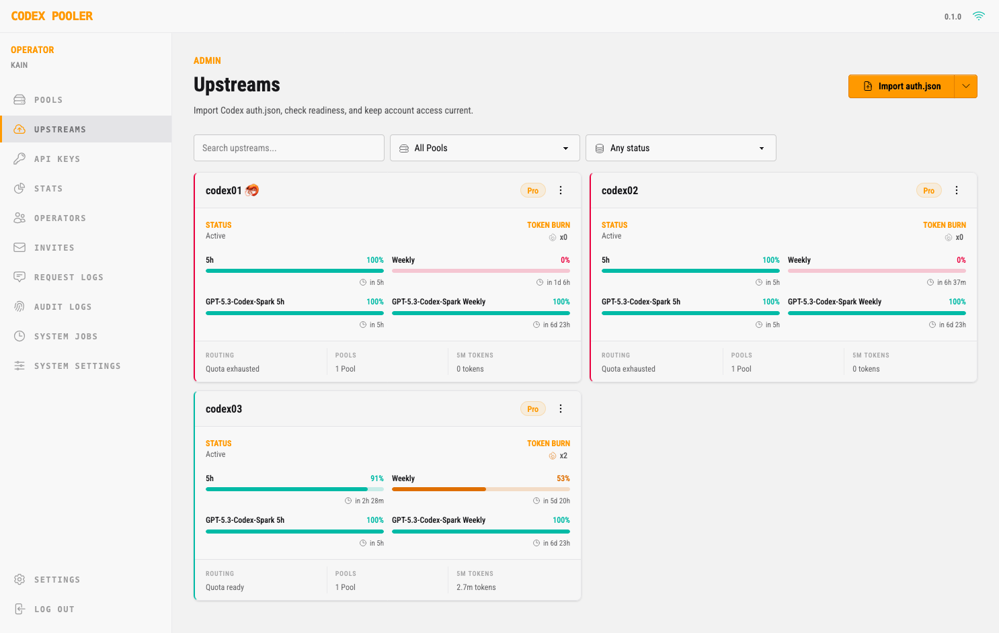
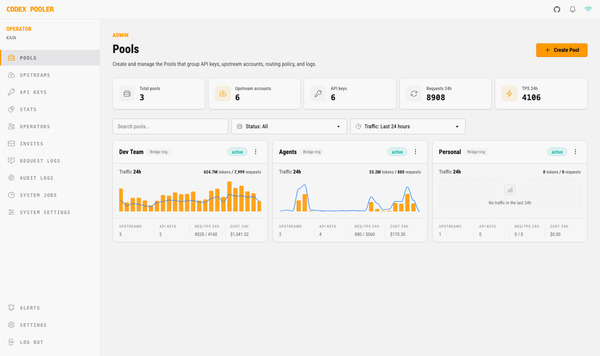
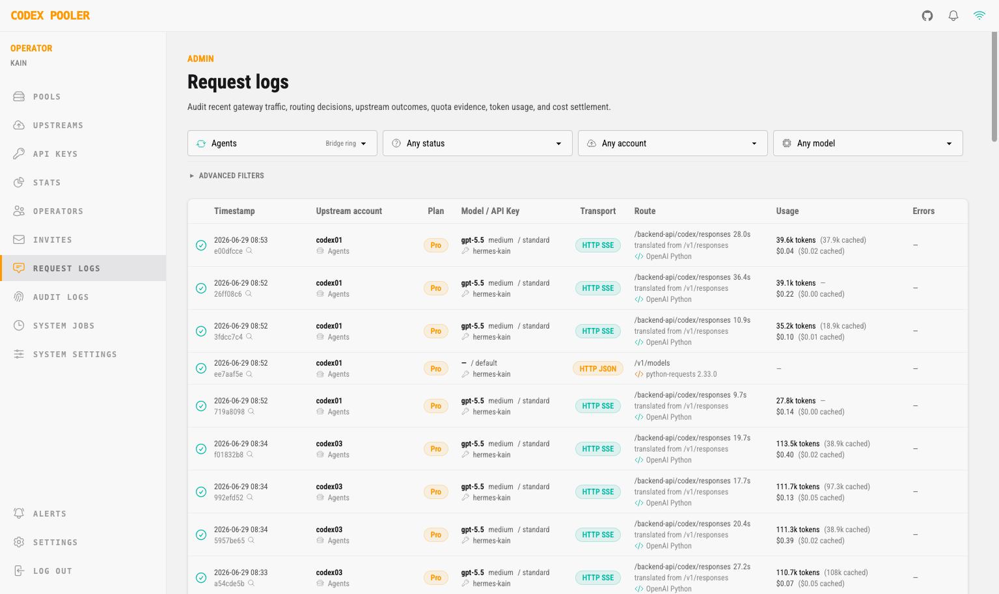
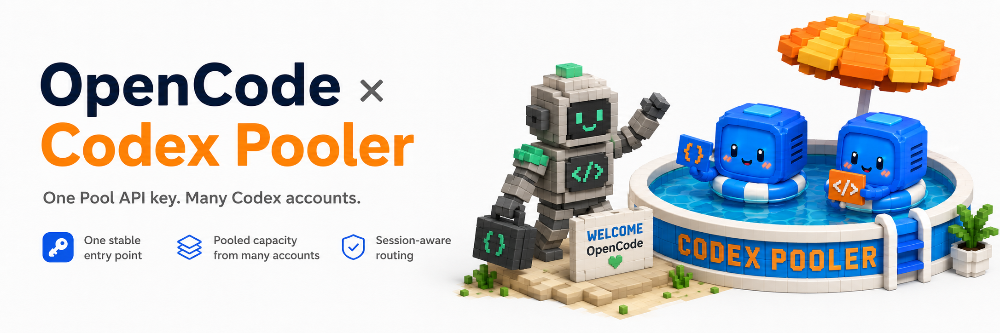
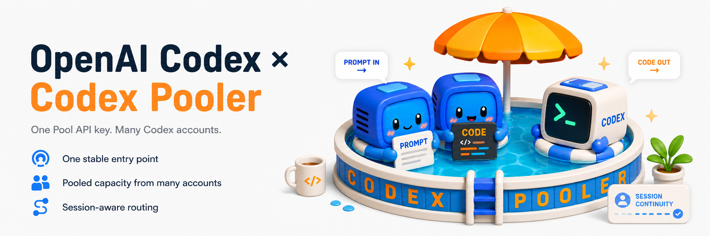
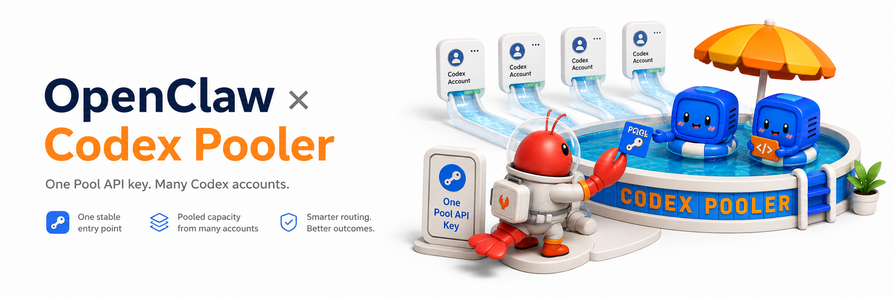
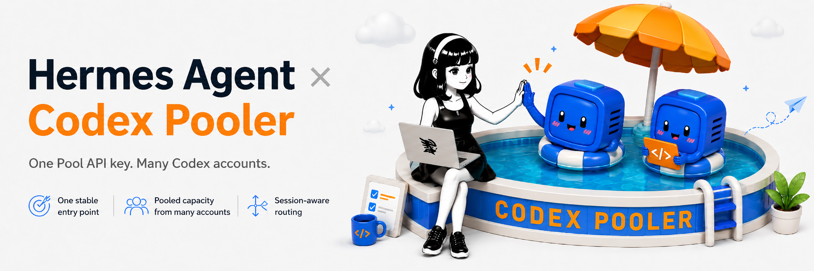
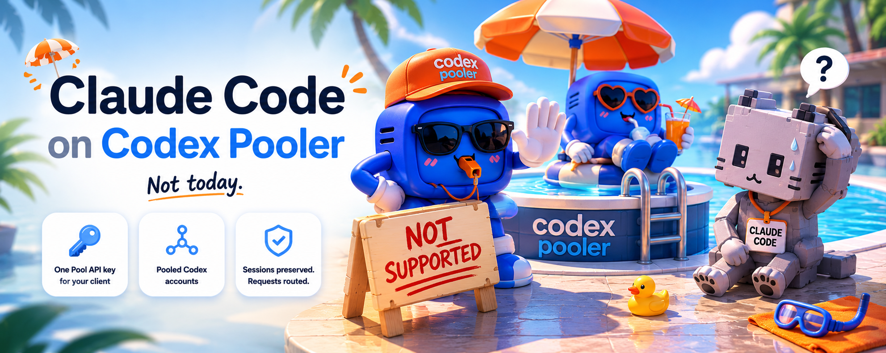

<h1 align="center">Codex Pooler</h1>

<p align="center">
  <strong>The full featured self-hosted Codex gateway, for teams, agents and you. Works with:</strong><br>
  <br>
  <a href="https://docs.codex-pooler.com/clients/opencode/" title="OpenCode"></a>
  <a href="https://docs.codex-pooler.com/clients/codex-cli/" title="Codex CLI and Codex Desktop"></a>
  <a href="https://docs.codex-pooler.com/clients/openclaw/" title="OpenClaw"></a>
  <a href="https://docs.codex-pooler.com/clients/hermes/" title="Hermes Agent"></a>
  <a href="https://docs.codex-pooler.com/clients/pi/" title="Pi"></a>
  <a href="https://docs.codex-pooler.com/clients/omp/" title="OMP"></a>
  <a href="https://docs.codex-pooler.com/clients/kilo/" title="Kilo"></a>
  <a href="https://docs.codex-pooler.com/clients/trae/" title="Trae"></a>
  <a href="https://docs.codex-pooler.com/clients/aider/" title="Aider"></a>
  <a href="https://docs.codex-pooler.com/clients/continue/" title="Continue"></a>
  <a href="https://docs.codex-pooler.com/clients/cline/" title="Cline"></a>
  <a href="https://docs.codex-pooler.com/clients/goose/" title="Goose"></a>
  <a href="https://docs.codex-pooler.com/clients/windmill/" title="Windmill AI"></a>
  <a href="https://docs.codex-pooler.com/clients/openhands/" title="OpenHands"></a>
  <a href="https://docs.codex-pooler.com/clients/openai-compatible/" title="OpenAI-compatible SDKs"></a>
  <a href="https://docs.codex-pooler.com/clients/openai-compatible/" title="OpenAI-compatible SDKs"></a>
  <a href="https://docs.codex-pooler.com/clients/openai-compatible/" title="Vercel AI SDK"></a>
</p>

<p align="center">
  <strong>English</strong>
  ·
  <a href="README.zh-CN.md">简体中文</a>
</p>

<p align="center">
  <a href="#quick-start-with-docker-compose">Quick start</a>
  ·
  <a href="#harness-configuration">Harness</a>
  ·
  <a href="#configuration">Configuration</a>
  ·
  <a href="#deployment">Deployment</a>
</p>

<p align="center">
  
</p>

<table>
  <tr>
    <td align="center" valign="top" width="33%">
      <a href=".github/assets/screen1.png">
        
      </a><br>
      <sub>Upstreams</sub>
    </td>
    <td align="center" valign="top" width="33%">
      <a href=".github/assets/screen2.png">
        
      </a><br>
      <sub>Pools</sub>
    </td>
    <td align="center" valign="top" width="33%">
      <a href=".github/assets/screen3.png">
        
      </a><br>
      <sub>Request logs</sub>
    </td>
  </tr>
</table>

Codex Pooler is a self-hosted gateway for running Codex-compatible agents,
tools, and automation through stable Pool API keys. It works with one upstream
Codex account for credential isolation, client normalization, metadata-only
operations, and saved reset visibility; add more accounts when you want shared
capacity and routing across eligible accounts.

Clients send familiar Codex backend or OpenAI-compatible requests; Codex Pooler
selects an eligible account based on model support, quota evidence, limits,
session continuity, routing policy, and health. The Pool key stays stable while
upstream assignments, lifecycle state, reset policy, and capacity change behind
it.

Operators get one place to manage Pools, accounts, API keys, saved resets,
routing, request accounting, audit logs, and health without storing prompts,
files, audio, images, bearer tokens, or raw Codex secrets. Instance owners keep
the global administration surface, while instance admins work only with their
assigned Pools.

## Highlights

- 🔑 **Stable Pool API keys:** give clients one Pool credential whether the Pool
  currently has one upstream account or several, without distributing raw Codex
  account material
- 🎯 **Eligibility-aware routing:** route each request to an account with compatible
  model support, usable quota evidence, matching health, session state, and Pool
  policy
- 🧩 **Codex backend compatibility:** point Codex-compatible clients at Codex
  Pooler and keep responses, compacting, usage, files, audio, images, and
  backend websocket flows working through assigned accounts
- 🔌 **OpenAI-compatible SDK surface:** let `/v1`-only apps and agent tools use
  Codex capacity through the same Pool boundary, with supported requests
  translated and routed to help contain API spend
- 🔁 **Session-aware websockets:** keep resumable Codex sessions and websocket
  reconnects attached to the right upstream account without translating backend
  websocket traffic through an HTTP compatibility layer
- ⚡ **Prompt-cache locality:** use a transient `prompt_cache_key` to prefer the
  same eligible upstream account for repeat stateless requests, improving
  provider-side cache locality without storing prompts or responses locally
- 🗜️ **Per-Pool request compression:** optionally compress upstream-bound
  Responses tool outputs before dispatch on supported request routes. The
  option is disabled by default, request-side only, and records safe aggregate
  savings without storing raw outputs.
- 🏦 **Saved reset management:** surface reported saved reset capacity on upstream
  accounts, show informational expirations when available, and let operators
  queue account-level recovery or opt into guarded auto-redemption policy
- 🚨 **Operator alerting:** define Pool-aware rules for capacity, upstream health,
  saved reset events, and delivery failures, then notify operators through
  admin incidents, email, or webhooks without exposing raw request content
- 🖥️ **Operator dashboard:** manage Pool-scoped accounts, API keys, invites, saved
  resets, usage, request logs, audit logs, MCP access, and the owner-only jobs,
  operators, and system settings surfaces
- 🛡️ **Privacy-minded observability:** store request, routing, and audit metadata
  without storing prompts, file bodies, audio, images, bearer tokens, cookies,
  raw Codex account tokens, or raw API keys
- ⚙️ **Configurable without code changes:** tune Pool policy, gateway defaults,
  diagnostics, model support, limits, and operational settings from the admin UI
- 🐳 **Built for self-hosting:** run on Elixir/Erlang's fault-tolerant runtime,
  start locally with Docker Compose, or deploy the Helm chart with separate web,
  worker, scheduler, and migration roles for Kubernetes-friendly, multinode
  growth

## Harness Configuration

Keep Pool API keys in environment variables when the harness supports secret
expansion. The `/mcp` endpoint is an optional operator-only add-on for metadata
inspection; Codex Pooler runtime clients do not need it. If a desktop harness
persists remote MCP headers in its own private settings, use a dedicated
operator-scoped MCP token. For a local instance, the URLs are:

```text
Codex backend base URL:      http://localhost:4000/backend-api/codex
OpenAI SDK base URL:         http://localhost:4000/v1
Optional operator MCP URL:   http://localhost:4000/mcp
```

For a deployed instance, replace `http://localhost:4000` with your deployed host,
for example `https://codex-pooler.example.com`.

<details>
<summary> OpenCode <code>~/.config/opencode/opencode.jsonc</code></summary>



OpenCode talks to Codex Pooler through the OpenAI-compatible `/v1` surface. Keep
the provider id as `openai` for this setup so OpenCode continues to use its
OpenAI provider-family behavior. The provider uses the Pool API key, and the
optional remote MCP entry uses an operator-owned MCP token. MCP is not required
for OpenCode to use Codex Pooler; it only gives an operator MCP host read-only
metadata tools. Its websocket
support is the narrow Responses websocket route at `GET /v1/responses`, not
OpenAI Realtime SDK compatibility.

```jsonc
{
  "$schema": "https://opencode.ai/config.json",
  "provider": {
    "openai": {
      "npm": "@ai-sdk/openai",
      "name": "Codex Pooler",
      "options": {
        "baseURL": "http://localhost:4000/v1",
        "apiKey": "{env:CODEX_POOLER_API_KEY}",
        "reasoningEffort": "high",
        "reasoningSummary": "auto",
        "textVerbosity": "medium",
        "include": ["reasoning.encrypted_content"],
        "store": false
      },
      "models": {
        "gpt-5.6-luna": {
          "id": "gpt-5.6-luna",
          "name": "GPT-5.6 Luna",
          "family": "gpt",
          "attachment": true,
          "reasoning": true,
          "tool_call": true,
          "temperature": false,
          "modalities": {
            "input": ["text", "image"],
            "output": ["text"]
          },
          "limit": {
            "context": 258400,
            "input": 194400,
            "output": 64000
          }
        },
        "gpt-5.6-terra": {
          "id": "gpt-5.6-terra",
          "name": "GPT-5.6 Terra",
          "family": "gpt",
          "attachment": true,
          "reasoning": true,
          "tool_call": true,
          "temperature": false,
          "modalities": {
            "input": ["text", "image"],
            "output": ["text"]
          },
          "limit": {
            "context": 258400,
            "input": 194400,
            "output": 64000
          }
        },
        "gpt-5.6-sol": {
          "id": "gpt-5.6-sol",
          "name": "GPT-5.6 Sol",
          "family": "gpt",
          "attachment": true,
          "reasoning": true,
          "tool_call": true,
          "temperature": false,
          "modalities": {
            "input": ["text", "image"],
            "output": ["text"]
          },
          "limit": {
            "context": 258400,
            "input": 194400,
            "output": 64000
          }
        }
      }
    }
  },
  // Optional operator-only MCP metadata add-on. Omit for normal model/runtime use.
  "mcp": {
    "codex_pooler": {
      "type": "remote",
      "url": "http://localhost:4000/mcp",
      "oauth": false,
      "headers": {
        "Authorization": "Bearer {env:CODEX_POOLER_MCP_KEY}"
      },
      "enabled": true,
      "timeout": 30000
    }
  }
}
```

Define only models that your assigned Pool can serve. For deployed instances,
change `baseURL` to `https://codex-pooler.example.com/v1`; if you keep the optional
operator MCP entry, change its `url` to `https://codex-pooler.example.com/mcp`.

OpenCode subtracts its compaction reserve from `limit.input` before deciding a
conversation is full. The `194400` value leaves 174k usable input tokens after
OpenCode's default 20k reserve, so 174k input plus a 64k output cap stays inside
the 258.4k GPT-5.6 window used by these examples. OpenCode's request layer caps
output at 32k by default; set `OPENCODE_EXPERIMENTAL_OUTPUT_TOKEN_MAX=64000`
only if you want OpenCode to request the full 64k cap.

</details>

<details>
<summary> Codex CLI and Codex Desktop <code>CODEX_HOME/config.toml</code></summary>



Codex CLI and Codex Desktop should use the backend compatibility route, not the
`/v1` SDK route. They share the same Codex configuration layers and user-level
`CODEX_HOME/config.toml`, so one Codex Pooler provider block can serve the
terminal and desktop/IDE experience. Keep the provider id as `codex-pooler-ws`,
but keep the provider `name` exactly `OpenAI`. In current Codex sources, `name`
is not just
a display label: exact `OpenAI` matching enables OpenAI-family behavior such as
remote compaction, web search/image availability, and Codex backend request
compression.

Put provider and auth settings in the user-level config file. Codex resolves
`CODEX_HOME` first. If `CODEX_HOME` is unset, current Codex sources default it
to `$HOME/.codex` on every OS, so the user config file is
`CODEX_HOME/config.toml`.

| OS | Default config file |
| --- | --- |
| macOS | `$HOME/.codex/config.toml` |
| Linux | `$HOME/.codex/config.toml` |
| Windows | `$HOME\.codex\config.toml`, normally `%USERPROFILE%\.codex\config.toml` |

Codex's project-local `.codex/config.toml` layers are trust-gated and do not
override machine-local provider keys such as `model_provider` or
`model_providers`.

Use the websocket provider for normal Codex CLI and Codex Desktop backend
behavior:

```toml
model_provider = "codex-pooler-ws"

[model_providers.codex-pooler-ws]
name = "OpenAI"
base_url = "http://localhost:4000/backend-api/codex"
env_key = "CODEX_POOLER_API_KEY"
wire_api = "responses"
supports_websockets = true
requires_openai_auth = true
```

Keep an HTTP/SSE provider when you need to force non-websocket behavior for a
client check or when a Codex runtime cannot open backend websocket streams:

```toml
model_provider = "codex-pooler-http"

[model_providers.codex-pooler-http]
name = "OpenAI"
base_url = "http://localhost:4000/backend-api/codex"
env_key = "CODEX_POOLER_API_KEY"
wire_api = "responses"
supports_websockets = false
requires_openai_auth = true
```

For deployed instances, change `base_url` to
`https://codex-pooler.example.com/backend-api/codex`.

Leave `requires_openai_auth = true` unless you are deliberately running Codex
Pooler as a gateway-only provider. With `true`, Codex still shows the local
OpenAI/ChatGPT account as signed in, which keeps Codex Desktop and app-server
features that depend on account state available. The Pool API key in `env_key`
still authenticates requests to Codex Pooler.

If Codex repeatedly enters a broken login/account state with a Pooler provider,
advanced users can change the provider to `requires_openai_auth = false`. That
makes Codex treat the provider as gateway-only and use only `env_key` for
runtime auth, but Codex will no longer appear signed in for that provider and
account-dependent features, including mobile/app-server features, may be
unavailable.

When Codex Pooler serves current model metadata, Codex does not need explicit
client-side context overrides. If you must pin `gpt-5.6-terra` before Codex has
refreshed backend metadata, use Codex's raw window fields:
`model_context_window = 272000` and `model_auto_compact_token_limit = 244800`.
Codex computes an effective 95% turn budget, so the client-visible budget is
258400 tokens, and it does not send an OpenAI SDK-style output cap on normal
`/responses` turns.

Optional operator-only MCP metadata add-on. Omit for normal Codex runtime use:

```toml
[mcp_servers.codex_pooler]
url = "http://localhost:4000/mcp"
bearer_token_env_var = "CODEX_POOLER_MCP_KEY"
```

For deployed instances, change the optional MCP `url` to
`https://codex-pooler.example.com/mcp`.

Codex filters resumable conversations by `model_provider`. If you already have
Codex CLI or Codex Desktop sessions created with the built-in `openai` provider
and want them to appear under `codex-pooler-ws`, re-tag both the JSONL
transcripts and the newer SQLite state database. Close Codex first; these
commands edit local Codex state in place. If you made the HTTP provider your
default, replace only the destination value `codex-pooler-ws` with
`codex-pooler-http` before copying.

#### macOS (zsh)

Run these two zsh one-liners:

```zsh
if [ -d "$HOME/.codex/sessions" ]; then find "$HOME/.codex/sessions" -type f -name '*.jsonl' -exec perl -0pi -e 's/("model_provider"\s*:\s*)"openai"/$1"codex-pooler-ws"/g' {} +; fi
```

```zsh
for db in "$HOME"/.codex/state_*.sqlite(N); do sqlite3 "$db" "UPDATE threads SET model_provider = 'codex-pooler-ws' WHERE model_provider = 'openai';"; done
```

#### Linux (bash)

Run these two bash one-liners:

```bash
if [ -d "$HOME/.codex/sessions" ]; then find "$HOME/.codex/sessions" -type f -name '*.jsonl' -exec perl -0pi -e 's/("model_provider"\s*:\s*)"openai"/$1"codex-pooler-ws"/g' {} +; fi
```

```bash
for db in "$HOME"/.codex/state_*.sqlite; do [ -e "$db" ] || continue; sqlite3 "$db" "UPDATE threads SET model_provider = 'codex-pooler-ws' WHERE model_provider = 'openai';"; done
```

#### Windows (PowerShell)

Run the same migration from PowerShell. This expects `sqlite3` to be available
on `PATH`.

```powershell
$ErrorActionPreference = "Stop"

$FromProvider = "openai"
$ToProvider = "codex-pooler-ws"
$CodexHome = Join-Path $HOME ".codex"

$FromJson = '"model_provider":"' + $FromProvider + '"'
$ToJson = '"model_provider":"' + $ToProvider + '"'

Get-ChildItem -Path (Join-Path $CodexHome "sessions") -Recurse -Filter "*.jsonl" |
  ForEach-Object {
    $Path = $_.FullName
    $TempPath = "$Path.tmp"
    $Reader = [System.IO.StreamReader]::new($Path)
    $Writer = [System.IO.StreamWriter]::new(
      $TempPath,
      $false,
      [System.Text.UTF8Encoding]::new($false)
    )

    try {
      while (($Line = $Reader.ReadLine()) -ne $null) {
        $Writer.WriteLine($Line.Replace($FromJson, $ToJson))
      }
    } finally {
      $Reader.Dispose()
      $Writer.Dispose()
    }

    Move-Item -Force $TempPath $Path
  }

Get-ChildItem -Path $CodexHome -Filter "state_*.sqlite" |
  ForEach-Object {
    sqlite3 $_.FullName `
      "UPDATE threads SET model_provider = '$ToProvider' WHERE model_provider = '$FromProvider';"
  }
```

</details>

<details>
<summary> OpenClaw <code>~/.openclaw/openclaw.json</code></summary>



OpenClaw uses `openai/*` as the canonical OpenAI route. To keep that model name
while sending agent turns to Codex Pooler's OpenAI-compatible `/v1` surface,
point the OpenAI provider at Codex Pooler and use the current OpenClaw runtime id.

```json5
{
  agents: {
    defaults: {
      model: {
        primary: "openai/gpt-5.6-terra",
        list: [
          {
            id: "background",
            model: "openai/gpt-5.6-luna",
          },
        ],
      },
      compaction: { reserveTokens: 128000 },
    },
  },
  models: {
    mode: "merge",
    providers: {
      openai: {
        baseUrl: "http://localhost:4000/v1",
        apiKey: "${CODEX_POOLER_API_KEY}",
        api: "openai-responses",
        agentRuntime: { id: "openclaw" },
        timeoutSeconds: 300,
        models: [
          {
            id: "gpt-5.6-luna",
            name: "GPT-5.6 Luna via Codex Pooler",
            reasoning: true,
            input: ["text", "image"],
            contextWindow: 272000,
            contextTokens: 258400,
            maxTokens: 128000,
          },
          {
            id: "gpt-5.6-terra",
            name: "GPT-5.6 Terra via Codex Pooler",
            reasoning: true,
            input: ["text", "image"],
            contextWindow: 272000,
            contextTokens: 258400,
            maxTokens: 128000,
          },
          {
            id: "gpt-5.6-sol",
            name: "GPT-5.6 Sol via Codex Pooler",
            reasoning: true,
            input: ["text", "image"],
            contextWindow: 272000,
            contextTokens: 258400,
            maxTokens: 128000,
          },
        ],
      },
    },
  },
  // Optional operator-only MCP metadata add-on. Omit for normal model/runtime use.
  mcp: {
    servers: {
      codex_pooler: {
        url: "http://localhost:4000/mcp",
        transport: "streamable-http",
        headers: {
          Authorization: "Bearer ${CODEX_POOLER_MCP_KEY}",
        },
      },
    },
  },
}
```

Define only models that your assigned Pool can serve. For deployed instances,
change `baseUrl` to `https://codex-pooler.example.com/v1`; if you keep the optional
operator MCP add-on, change its `url` to `https://codex-pooler.example.com/mcp`.

OpenClaw keeps `contextWindow` as the provider/native window and uses
`contextTokens` as the effective runtime budget. Codex-served GPT-5.6 examples
use the Codex raw 272k window, the 258400 effective budget, and a 128k output
budget; the explicit compaction reserve keeps local prompt history under the
remaining 130400-token budget before a long completion. Use `gpt-5.6-luna` for
background routing, keep `gpt-5.6-terra` as the primary model, and switch a
session to `gpt-5.6-sol` only for heavy reasoning.

If you prefer to keep Codex Pooler separate from OpenClaw's built-in OpenAI
provider behavior, use a custom provider id such as `codex-pooler/gpt-5.6-terra`
instead. That follows OpenClaw's generic custom-provider shape, but tools that
look specifically for `openai/gpt-*` model refs will not see it as canonical
OpenAI.

</details>

<details>
<summary> Hermes Agent <code>~/.hermes/config.yaml</code> + <code>auth.json</code></summary>



Hermes works best through its `openai-api` provider with the Responses transport
forced explicitly. This is the recommended Codex Pooler setup. Keep the Pool API
key in `~/.hermes/.env` and point the provider config at Codex Pooler's `/v1`
surface. Include Hermes' `image_gen` block when you want image generation or
edits through the same OpenAI-compatible path. The `mcp_servers` block is an
optional operator-only add-on for read-only metadata tools; Codex Pooler works
without it.

```bash
OPENAI_API_KEY=<pool-api-key>
OPENAI_BASE_URL=http://localhost:4000/v1
# Optional operator-only MCP metadata add-on:
CODEX_POOLER_MCP_KEY=<operator-mcp-token>
```

```yaml
model:
  default: gpt-5.6-terra
  provider: openai-api
  base_url: http://localhost:4000/v1
  api_mode: codex_responses
  context_length: 258400
  supports_vision: true

agent:
  image_input_mode: native

image_gen:
  provider: openai
  model: gpt-image-2-medium

auxiliary:
  compression:
    timeout: 900

# Optional operator-only MCP metadata add-on. Omit for model/runtime use.
mcp_servers:
  codex_pooler:
    url: http://localhost:4000/mcp
    headers:
      Authorization: "Bearer ${CODEX_POOLER_MCP_KEY}"
    enabled: true
    timeout: 120
    connect_timeout: 15
```

Image generation note: `image_gen.provider: openai` is the recommended image
provider for this setup. Hermes exposes `gpt-image-2-low`,
`gpt-image-2-medium`, and `gpt-image-2-high` as quality tiers; for example,
`gpt-image-2-medium` sends `gpt-image-2` to the API with `quality: medium`.
This provider uses the OpenAI SDK environment, so `OPENAI_API_KEY` and
`OPENAI_BASE_URL` must be visible to the running Hermes process, not only to
the shell where you edited the config. `model.base_url` configures Hermes'
text/model provider path; the OpenAI image provider still needs the SDK
environment so image requests go through Codex Pooler's `/v1` surface instead
of OpenAI directly.

If text requests work but image generation fails with `invalid_api_key`, check
the environment of the long-running Hermes process or gateway service first.
It may not have loaded `OPENAI_BASE_URL`, so the OpenAI SDK image client may be
using OpenAI's default endpoint instead of Codex Pooler.

Current Codex Pooler releases also expose an SDK-readable `context_length` value
on `/v1/models`, derived from the effective Codex `context_window` metadata, so
Hermes' automatic probes can resolve the Pooler window. For the GPT-5.6 examples
here, use the Codex raw 272000 window and the 258400 effective advertised value.
Keep `context_length: 258400` in Hermes config as an explicit override when
Hermes cannot read `/v1/models` first.

Hermes context compression uses its own auxiliary request timeout. Keep
`auxiliary.compression.timeout: 900` so large retained contexts can finish
instead of cycling through the older 120-second compression budget. This is
independent from the optional MCP server `timeout`.

Remote HTTP MCP servers require Hermes' `mcp` extra. If
`hermes mcp test codex_pooler` reports `mcp.client.streamable_http is not
available`, install MCP support into the Hermes environment, following the
[Hermes MCP Integration docs](https://hermes-agent.nousresearch.com/docs/user-guide/features/mcp),
and rerun the test.

Check the one-shot model path:

```bash
hermes -z 'Reply with exactly: hermes openai api ok' --ignore-rules
```

Hermes can also be made to use its `openai-codex` provider against Codex
Pooler, but this alternate path is less direct because Hermes treats `openai-codex` as an
OAuth provider by default; add a Pool API key credential ahead of any existing
device-code credential and keep the entry's `base_url` on `/v1`. Use this only
when you specifically need Hermes' `openai-codex` credential-pool behavior; the
`openai-api` configuration above is the preferred setup. This variant stores the
key in `auth.json` because Hermes credential pools live there.

```bash
HERMES_CODEX_BASE_URL=http://localhost:4000/v1
# Optional operator-only MCP metadata add-on:
CODEX_POOLER_MCP_KEY=<operator-mcp-token>
```

```yaml
model:
  default: gpt-5.6-terra
  provider: openai-codex
  base_url: http://localhost:4000/v1
  context_length: 258400
  supports_vision: true

agent:
  image_input_mode: native

auxiliary:
  compression:
    timeout: 900

# Optional operator-only MCP metadata add-on. Omit for model/runtime use.
mcp_servers:
  codex_pooler:
    url: http://localhost:4000/mcp
    headers:
      Authorization: "Bearer ${CODEX_POOLER_MCP_KEY}"
    enabled: true
    timeout: 120
    connect_timeout: 15
```

```json
{
  "active_provider": "openai-codex",
  "credential_pool": {
    "openai-codex": [
      {
        "label": "codex-pooler",
        "auth_type": "api_key",
        "priority": -10,
        "source": "manual",
        "access_token": "<pool-api-key>",
        "base_url": "http://localhost:4000/v1"
      }
    ]
  }
}
```

For deployed instances, change the model URLs to
`https://codex-pooler.example.com/v1`; if you keep the optional operator MCP add-on,
change the MCP `url` to `https://codex-pooler.example.com/mcp`.

</details>

<details>
<summary> Pi <code>~/.pi/agent/models.json</code> and <code>settings.json</code></summary>

Pi works best through a custom provider that uses Codex Pooler's narrow
OpenAI-compatible `/v1` Responses surface. Put custom providers and models in
`~/.pi/agent/models.json`; put global defaults in `~/.pi/agent/settings.json`;
use `.pi/settings.json` for project overrides; and keep saved trust decisions in
`~/.pi/agent/trust.json`. On Windows, use the same home-relative paths under the
user profile, for example `%USERPROFILE%\.pi\agent\models.json`.

Install Pi from npm so you get the latest published CLI:

```bash
npm install -g --ignore-scripts @earendil-works/pi-coding-agent
```

Then add a provider to `~/.pi/agent/models.json`:

```json
{
  "providers": {
    "codex-pooler": {
      "name": "Codex Pooler",
      "baseUrl": "http://localhost:4000/v1",
      "api": "openai-responses",
      "apiKey": "$CODEX_POOLER_API_KEY",
      "authHeader": true,
      "models": [
        {
          "id": "gpt-5.6-luna",
          "name": "GPT-5.6 Luna via Codex Pooler",
          "reasoning": true,
          "thinkingLevelMap": {
            "xhigh": "xhigh"
          },
          "input": ["text", "image"],
          "contextWindow": 258400,
          "maxTokens": 128000
        },
        {
          "id": "gpt-5.6-terra",
          "name": "GPT-5.6 Terra via Codex Pooler",
          "reasoning": true,
          "thinkingLevelMap": {
            "xhigh": "xhigh"
          },
          "input": ["text", "image"],
          "contextWindow": 258400,
          "maxTokens": 128000
        },
        {
          "id": "gpt-5.6-sol",
          "name": "GPT-5.6 Sol via Codex Pooler",
          "reasoning": true,
          "thinkingLevelMap": {
            "xhigh": "xhigh"
          },
          "input": ["text", "image"],
          "contextWindow": 258400,
          "maxTokens": 128000
        }
      ]
    }
  }
}
```

`authHeader: true` makes Pi send the Pool API key as
`Authorization: Bearer ...`. Define only model ids your assigned Pool can serve.
For deployed instances, change `baseUrl` to
`https://codex-pooler.example.com/v1`.

Current Pi source still requires the explicit `thinkingLevelMap` entry for Pi
to expose `xhigh` in the model picker and footer. Without it, Pi treats `xhigh`
as unsupported for a custom model and clamps `--thinking xhigh` or
`defaultThinkingLevel: "xhigh"` to `high`.

Pi accepts `contextWindow` and `maxTokens` for custom models; it has no
`contextTokens` field. Use a 258.4k context window and 128k output budget for the
GPT-5.6 custom entries so Pi's local context accounting matches Codex
Pooler's advertised model metadata. The explicit
compaction reserve makes Pi compact before a prompt plus a long completion can
exceed that 258.4k window.

Optionally set Codex Pooler as the default Pi model in
`~/.pi/agent/settings.json`:

```json
{
  "defaultProvider": "codex-pooler",
  "defaultModel": "gpt-5.6-terra",
  "defaultThinkingLevel": "xhigh",
  "enabledModels": [
    "codex-pooler/gpt-5.6-luna",
    "codex-pooler/gpt-5.6-terra",
    "codex-pooler/gpt-5.6-sol"
  ],
  "compaction": {
    "reserveTokens": 128000
  }
}
```

Check the non-interactive path from a repository:

```bash
export CODEX_POOLER_API_KEY=<pool-api-key>
pi --provider codex-pooler \
  --model gpt-5.6-terra \
  --no-session \
  --no-context-files \
  --tools bash \
  -p 'Reply with exactly: pi ok'
```

Pi does not ship built-in MCP support. Codex Pooler model use does not require
MCP; if you need operator metadata, use a separate MCP-capable host with an
operator MCP token.

</details>

<details>
<summary> OMP <code>~/.omp/agent/models.yml</code> and <code>config.yml</code></summary>

Oh My Pi (OMP) is a Pi fork, but it should be treated as a separate Codex
Pooler harness: it has its own package, `omp` binary, YAML config, and model
role defaults. Install the current CLI through Bun:

```bash
bun install -g @oh-my-pi/pi-coding-agent
```

Then add a provider to `~/.omp/agent/models.yml`:

```yaml
providers:
  codex-pooler:
    baseUrl: http://localhost:4000/v1
    api: openai-responses
    apiKey: CODEX_POOLER_API_KEY
    authHeader: true
    remoteCompaction:
      enabled: true
      api: openai-codex-responses
      endpoint: http://localhost:4000/backend-api/codex/responses/compact
      v2StreamingEnabled: true
      v2Endpoint: http://localhost:4000/backend-api/codex/responses
    models:
      - id: gpt-5.6-terra
        name: GPT-5.6 Terra via Codex Pooler
        reasoning: true
        input:
          - text
          - image
        compat:
          streamIdleTimeoutMs: 300000
        contextWindow: 258400
        maxTokens: 128000
      - id: gpt-5.6-luna
        name: GPT-5.6 Luna via Codex Pooler
        reasoning: true
        input:
          - text
          - image
        compat:
          streamIdleTimeoutMs: 300000
        contextWindow: 258400
        maxTokens: 128000
      - id: gpt-5.6-sol
        name: GPT-5.6 Sol via Codex Pooler
        reasoning: true
        input:
          - text
          - image
        compat:
          streamIdleTimeoutMs: 300000
        contextWindow: 258400
        maxTokens: 128000
```

`apiKey: CODEX_POOLER_API_KEY` makes OMP resolve that environment variable at
runtime. `authHeader: true` makes OMP send the Pool API key as
`Authorization: Bearer ...`. Define only model ids your assigned Pool can
serve. For deployed instances, change `baseUrl` to
`https://codex-pooler.example.com/v1` and change `remoteCompaction.endpoint` to
`https://codex-pooler.example.com/backend-api/codex/responses/compact`; change
`remoteCompaction.v2Endpoint` to
`https://codex-pooler.example.com/backend-api/codex/responses`.

Keep `remoteCompaction` under the `codex-pooler` provider so `/compact remote`
can use Codex Pooler's backend compact route while normal OMP model traffic stays
on the narrow OpenAI-compatible `/v1` Responses route. Do not use
`compaction.remoteEndpoint` for this path: OMP reserves that setting for generic
summary services that accept `{systemPrompt, prompt}` JSON, not provider-native
Responses compact payloads. In this setup, `omp config get
compaction.remoteEndpoint` should remain `(not set)`; remote capability comes
from the provider-level `remoteCompaction` block in `models.yml`.

`remoteCompaction.v2StreamingEnabled: true` lets OMP use the Codex-style
streaming compaction path. OMP sends a normal backend Responses request with a
terminal `compaction_trigger` to `remoteCompaction.v2Endpoint`; Codex Pooler
bridges that request to the backend compact route and returns Responses SSE. The
V2 flag is not a global `compaction` setting: keep it inside
`remoteCompaction`.

Current OMP source derives an effort thinking surface, including `xhigh`, for
custom `openai-responses` models that set `reasoning: true`. You only need an
explicit `thinking` block if you want to override the inferred effort list,
wire mapping, or per-model default level.

OMP accepts `contextWindow` and `maxTokens` in `models.yml`; it does not accept
`contextTokens`. The examples keep the GPT-5.6 tiered models on a 258.4k context
window and 128k output budget: `gpt-5.6-luna` handles lightweight roles,
`gpt-5.6-terra` handles daily agent work, and `gpt-5.6-sol` is reserved for
slow, planning, and design escalation. `compaction.reserveTokens: 128000` asks
OMP to compact before a prompt plus a long completion can exceed that 258.4k
window.

For long tool-heavy OMP sessions, keep mid-turn compaction enabled and persist
handoff material to disk. Those settings reduce context-overflow risk, but they
cannot repair an OMP client bug that skips its own mid-run compaction check. If
an OMP plan appears to restart work after a very large turn, upgrade OMP when a
newer release is available and restart or resume the session before treating it
as a Codex Pooler routing issue.

`compat.streamIdleTimeoutMs: 300000` keeps long OpenAI Responses reasoning turns
from being aborted by OMP's semantic-progress idle watchdog while Codex Pooler
and the upstream account are still working. Existing OMP sessions need to be
restarted or resumed after this config change. As an environment-only override,
set `PI_OPENAI_STREAM_IDLE_TIMEOUT_MS=300000` before launching `omp`.

Optionally set Codex Pooler as the default OMP model roles in
`~/.omp/agent/config.yml`:

```yaml
startup:
  setupWizard: false
defaultThinkingLevel: xhigh
enabledModels:
  - codex-pooler/gpt-5.6-luna
  - codex-pooler/gpt-5.6-terra
  - codex-pooler/gpt-5.6-sol
modelProviderOrder:
  - codex-pooler
modelRoles:
  default: codex-pooler/gpt-5.6-terra:xhigh
  smol: codex-pooler/gpt-5.6-luna:low
  tiny: codex-pooler/gpt-5.6-luna:minimal
  slow: codex-pooler/gpt-5.6-sol:xhigh
  plan: codex-pooler/gpt-5.6-sol:xhigh
  task: codex-pooler/gpt-5.6-terra:high
  vision: codex-pooler/gpt-5.6-terra:high
  advisor: codex-pooler/gpt-5.6-terra:medium
  commit: codex-pooler/gpt-5.6-luna:minimal
  designer: codex-pooler/gpt-5.6-sol:high
compaction:
  reserveTokens: 128000
  remoteEnabled: true
  remoteStreamingV2Enabled: true
  midTurnEnabled: true
  handoffSaveToDisk: true
```

Check the non-interactive path from a repository:

```bash
export CODEX_POOLER_API_KEY=<pool-api-key>
omp --model codex-pooler/gpt-5.6-terra:xhigh \
  --no-session \
  --tools bash \
  -p 'Reply with exactly: omp ok'
```

OMP ships MCP-capable tooling, but Codex Pooler model use does not require MCP.
If you use Codex Pooler's optional operator MCP endpoint, keep the `/mcp`
operator token separate from the Pool API key used for `/v1`.

</details>

<details>
<summary> Kilo <code>~/.config/kilo/kilo.jsonc</code></summary>

Kilo Code should use a named OpenAI-compatible provider whose base URL ends at
Codex Pooler's `/v1` surface. Kilo appends `/chat/completions` itself, so do
not put `/v1/chat/completions` in `baseURL`. Install the current CLI from npm:

```bash
npm install -g @kilocode/cli@latest
```

Then configure the provider in `~/.config/kilo/kilo.jsonc`:

```jsonc
{
  "$schema": "https://app.kilo.ai/config.json",
  "model": "codex-pooler/gpt-5.6-terra",
  "enabled_providers": ["codex-pooler"],
  "provider": {
    "codex-pooler": {
      "options": {
        "apiKey": "{env:CODEX_POOLER_API_KEY}",
        "baseURL": "http://localhost:4000/v1"
      },
      "models": {
        "gpt-5.6-luna": {
          "name": "GPT-5.6 Luna via Codex Pooler",
          "tool_call": true,
          "reasoning": true,
          "temperature": false,
          "attachment": true,
          "modalities": {
            "input": ["text", "image"],
            "output": ["text"]
          },
          "limit": {
            "context": 258400,
            "input": 194400,
            "output": 64000
          }
        },
        "gpt-5.6-terra": {
          "name": "GPT-5.6 Terra via Codex Pooler",
          "tool_call": true,
          "reasoning": true,
          "temperature": false,
          "attachment": true,
          "modalities": {
            "input": ["text", "image"],
            "output": ["text"]
          },
          "limit": {
            "context": 258400,
            "input": 194400,
            "output": 64000
          }
        },
        "gpt-5.6-sol": {
          "name": "GPT-5.6 Sol via Codex Pooler",
          "tool_call": true,
          "reasoning": true,
          "temperature": false,
          "attachment": true,
          "modalities": {
            "input": ["text", "image"],
            "output": ["text"]
          },
          "limit": {
            "context": 258400,
            "input": 194400,
            "output": 64000
          }
        }
      }
    }
  },
  "compaction": {
    "threshold_percent": 75
  }
}
```

Kilo uses OpenCode-style `limit.{context,input,output}` fields, but it includes
reasoning tokens in overflow accounting and uses `compaction.threshold_percent`
for preflight compaction. `limit.input: 194400` leaves 174k usable input tokens
after the default 20k reserve; the 75% threshold asks Kilo to compact earlier.
For GPT-5 OpenAI-compatible models, Kilo suppresses the outgoing max-token
request field to avoid incompatible `max_tokens`, so `limit.output` is still
important for local context math and UI even when it is not forwarded.

Define only model ids your assigned Pool can serve. For deployed instances,
change `baseURL` to `https://codex-pooler.example.com/v1`. If you add Kilo
permissions, use Kilo's object form such as `"permission": {"bash": "allow"}`;
do not set `"permission": "ask"`, which is not a valid config shape.

Check the headless tool path from an isolated directory:

```bash
mkdir -p /tmp/codex-pooler-kilo-check
cd /tmp/codex-pooler-kilo-check

export CODEX_POOLER_API_KEY=<pool-api-key>
kilo run \
  --model codex-pooler/gpt-5.6-terra \
  --pure \
  --auto \
  --format json \
  --dir "$PWD" \
  'Use your tools to create kilo-ok.txt containing exactly: kilo ok. After the file exists, reply with exactly: kilo ok'
```

`--pure` keeps external plugins out of the check. `--auto` is only for trusted,
isolated automation where Kilo may run approved tools without prompting. Codex
Pooler model use does not require MCP. If you need operator metadata, use a
separate MCP-capable host with an operator MCP token.

</details>

<details>
<summary> Trae <code>Settings -> Models</code></summary>

Trae and Trae CN are the same client family for this setup. Use Codex Pooler
through a custom model configured for OpenAI Chat Completions. This is a
chat-completions setup, not Codex backend compatibility and not full OpenAI API
parity.

Trae requires a Trae account session before the Models screen and agent chat
surface are usable. Sign in to Trae first.

Use a Pool API key for model requests. Do not reuse operator MCP tokens,
browser sessions, upstream account tokens, or imported account material.

```text
Custom Request URL:
https://codex-pooler.example.com/v1

Full URL:
off
```

Trae appends `/chat/completions` when Full URL is off. Do not end the custom
request URL with a slash.

In Trae, open Settings -> Models, add a custom model, and use these values:

| Field | Value |
| --- | --- |
| API format | OpenAI Chat Completions |
| Custom Request URL | `https://codex-pooler.example.com/v1` |
| Full URL | Off |
| Model ID | `gpt-5.6-terra` or another model id served by the assigned Pool |
| Multimodal | On when the Pool model supports image input |
| API key | Pool API key |
| Model Series | Default |
| Display Name | `GPT-5.6 Terra via Codex Pooler` |
| Context Window input | `184000` |
| Context Window output | `16000` |
| Tool Call Rounds | `200` |

In Trae CN, the same flow appears as Settings -> Models and custom
configuration in the localized UI. Use the same URL, model id, Pool API key,
and context values. If Full URL is enabled instead, use the full
`https://codex-pooler.example.com/v1/chat/completions` endpoint.

Check the Pool API key and model with a direct chat-completions request before
saving the client model:

```bash
curl -sS -X POST \
  -H "Authorization: Bearer $CODEX_POOLER_API_KEY" \
  -H "Content-Type: application/json" \
  --data '{
    "model": "gpt-5.6-terra",
    "messages": [
      { "role": "user", "content": "Reply with exactly: trae ok" }
    ],
    "stream": false,
    "max_completion_tokens": 16
  }' \
  https://codex-pooler.example.com/v1/chat/completions
```

For local setup, use `http://localhost:4000/v1` with Full URL off. Treat the
setup as working only when Trae's model add/check step succeeds and a real chat
can answer `trae ok` through the configured model.

After saving the custom model, open the agent model picker and turn Auto Mode
off. The model list is hidden behind Auto Mode by default; select the Codex
Pooler model under Custom Models.

Do not point Trae at `/backend-api/codex`, `/v1/responses`, `/mcp`, or a Codex
Pooler admin URL. Codex Pooler model use does not require MCP.

</details>

<details>
<summary> Aider <code>~/.aider.conf.yml</code></summary>

Aider uses the OpenAI-compatible route with the `openai/` model prefix. Put the
stable route settings in `.aider.conf.yml`; Aider loads this file from your home
directory, then the git repo root, then the current directory, with later files
taking priority.

```yaml
# ~/.aider.conf.yml or <repo>/.aider.conf.yml
model: openai/gpt-5.6-terra
openai-api-base: http://localhost:4000/v1
```

Aider's `.aider.conf.yml` route settings do not carry context or output limits. If your installed Aider version does not recognize `gpt-5.6-terra`, use Aider's separate model metadata JSON file for model behavior and limits instead of adding unsupported context fields to the main config.

```jsonc
// .aider.model.metadata.json
{
  "openai/gpt-5.6-luna": {
    "max_tokens": 258400,
    "max_input_tokens": 130400,
    "max_output_tokens": 128000,
    "litellm_provider": "openai",
    "mode": "chat",
    "supports_function_calling": true,
    "supports_vision": true,
    "supports_reasoning": true
  },
  "openai/gpt-5.6-terra": {
    "max_tokens": 258400,
    "max_input_tokens": 130400,
    "max_output_tokens": 128000,
    "litellm_provider": "openai",
    "mode": "chat",
    "supports_function_calling": true,
    "supports_vision": true,
    "supports_reasoning": true
  },
  "openai/gpt-5.6-sol": {
    "max_tokens": 258400,
    "max_input_tokens": 130400,
    "max_output_tokens": 128000,
    "litellm_provider": "openai",
    "mode": "chat",
    "supports_function_calling": true,
    "supports_vision": true,
    "supports_reasoning": true
  }
}
```

Keep the Pool API key out of the YAML file. Export it in the shell, or put it in
a gitignored `.env` file that Aider can load:

```bash
export OPENAI_API_KEY="$CODEX_POOLER_API_KEY"
```

Check Aider from a repository with a real file edit. The command should only need
the one-off prompt when the config file is present:

```bash
aider \
  --message 'Create a file named aider-ok.txt containing exactly: aider ok. After the file exists, reply with exactly: aider ok' \
  --yes-always \
  --no-auto-commits \
  --no-git \
  --no-browser \
  --no-gui \
  --no-analytics
```

The check is only useful if the file exists with the expected content; a text
reply alone does not prove Aider can edit through the configured model path.

For deployed instances, change `openai-api-base` to
`https://codex-pooler.example.com/v1`.

</details>

<details>
<summary> Continue <code>~/.continue/config.yaml</code></summary>

Continue can use Codex Pooler as an OpenAI-compatible provider by setting
`provider: openai`, `apiBase` to `/v1`, and the Pool API key as a Continue
secret. For `gpt-5*` models, Continue uses the Responses API by default.

For local Continue configs, put the assistant in `~/.continue/config.yaml` on
macOS/Linux or `%USERPROFILE%\.continue\config.yaml` on Windows. In the IDE
extension, open the Continue chat sidebar, use the config selector above the chat
input, then click the gear icon beside **Local Config**. Continue CLI resolves
`--config` first, then its saved last-used config, then the default assistant or
`~/.continue/config.yaml` when not logged in.


```yaml
name: Codex Pooler
version: 1.0.0
schema: v1

models:
  - name: GPT-5.6 Terra via Codex Pooler
    provider: openai
    model: gpt-5.6-terra
    apiBase: http://localhost:4000/v1
    apiKey: "${{ secrets.CODEX_POOLER_API_KEY }}"
    contextLength: 258400
    defaultCompletionOptions:
      maxTokens: 128000
    roles:
      - chat
      - edit
      - apply
      - summarize
    capabilities:
      - tool_use
      - image_input

# Optional operator-only MCP metadata add-on. Omit for model/runtime use.
mcpServers:
  - name: codex_pooler
    type: streamable-http
    url: http://localhost:4000/mcp
    requestOptions:
      timeout: 30000
      headers:
        Authorization: "Bearer ${{ secrets.CODEX_POOLER_MCP_KEY }}"
```

For deployed instances, change `apiBase` to `https://codex-pooler.example.com/v1`;
if you keep the optional operator MCP add-on, change the MCP `url` to
`https://codex-pooler.example.com/mcp`.

Continue uses `contextLength` for request pruning and
`defaultCompletionOptions.maxTokens` for the completion budget. It prunes rather
than summarizing/compacting locally, so keep the context length at Codex Pooler's
258.4k `gpt-5.6-terra` window instead of stale or generic provider metadata.

Check the headless CLI path after saving the config:

```bash
export CODEX_POOLER_API_KEY=<pool-api-key>
npx -y @continuedev/cli@latest -p \
  --config ~/.continue/config.yaml \
  --silent \
  'Reply with exactly: continue ok'
```

The Pool API key authenticates model requests. The MCP token authenticates only
the operator metadata endpoint.

</details>

<details>
<summary> Cline <code>~/.cline</code> + <code>~/.cline/mcp.json</code></summary>

Cline CLI accepts `openai` as shorthand for its OpenAI-compatible provider and
stores it as `openai-compatible`. Configure it with the Pool API key, the Codex
Pooler `/v1` base URL, and the model id that your assigned Pool can serve.

```bash
cline auth \
  --provider openai \
  --apikey "$CODEX_POOLER_API_KEY" \
  --baseurl http://localhost:4000/v1 \
  --modelid gpt-5.6-terra
```

Cline's model metadata names are `contextWindow`, `maxInputTokens`, and
`maxTokens`. If you add a manual Codex Pooler model entry in Cline settings, use
`contextWindow: 258400`, `maxInputTokens: 130400`, and `maxTokens: 128000` so
Cline's compaction trigger leaves room for a long completion inside the 258.4k
Pooler window.

Check the headless CLI path after saving auth:

```bash
cline --provider openai \
  --model gpt-5.6-terra \
  --json \
  --auto-approve false \
  'Reply with exactly: cline ok'
```

For optional operator MCP in Cline CLI, add the remote server to
`~/.cline/mcp.json`. Codex Pooler does not require this for model use. The VS
Code extension opens its own MCP settings JSON from the Cline MCP Servers panel;
use the same `mcpServers` shape there.

```json
{
  "mcpServers": {
    "codex_pooler": {
      "url": "http://localhost:4000/mcp",
      "headers": {
        "Authorization": "Bearer <operator-mcp-token>"
      },
      "disabled": false,
      "autoApprove": []
    }
  }
}
```

For deployed instances, change `--baseurl` to `https://codex-pooler.example.com/v1`
and, if you keep the optional operator MCP add-on, change the MCP `url` to
`https://codex-pooler.example.com/mcp`.

Use a Pool API key for `/v1` model requests and an operator MCP token for
`/mcp`. Do not reuse the Pool API key for MCP.

</details>

<details>
<summary> Goose <code>~/.config/goose/config.yaml</code></summary>

Configure Goose's OpenAI provider for Codex Pooler's OpenAI-compatible
chat-completions path. Keep the Pool API key in `OPENAI_API_KEY` or Goose's
secret storage.

Put persistent Goose provider and extension settings in
`~/.config/goose/config.yaml` on macOS/Linux or
`%APPDATA%\Block\goose\config\config.yaml` on Windows. Goose also keeps
related files in that config area: `permission.yaml` for tool permission levels,
`secrets.yaml` when file-based secret storage is used,
`permissions/tool_permissions.json` for runtime permission decisions, and
`prompts/` for prompt templates. Environment variables have higher precedence
than the config file, so `OPENAI_API_KEY` can stay outside YAML.


```yaml
GOOSE_PROVIDER: openai
GOOSE_MODEL: gpt-5.6-terra
OPENAI_HOST: http://localhost:4000
OPENAI_BASE_PATH: v1/chat/completions
GOOSE_CONTEXT_LIMIT: 258400
GOOSE_MAX_TOKENS: 128000
GOOSE_AUTO_COMPACT_THRESHOLD: 0.50
```

Goose reads `GOOSE_CONTEXT_LIMIT` and `GOOSE_MAX_TOKENS` into its model config.
Its auto-compaction threshold is a ratio of the context limit, not an output
reserve, so `0.50` compacts before prompt history can crowd out a 128k
completion in Codex Pooler's 258.4k `gpt-5.6-terra` window.

Check the headless CLI path with tool access enabled:

```bash
export OPENAI_API_KEY="$CODEX_POOLER_API_KEY"
goose run \
  --no-session \
  --provider openai \
  --model gpt-5.6-terra \
  --with-builtin developer \
  --text 'Use your developer tool to create goose-ok.txt containing exactly: goose ok. Then reply with exactly: goose ok'
```

For optional operator MCP metadata access, add a remote Streamable HTTP
extension. Codex Pooler model use does not require this. Goose stores remote
extension headers in its config, so use a dedicated MCP token.

```yaml
# Optional operator-only MCP metadata add-on. Omit for model/runtime use.
extensions:
  codex_pooler:
    enabled: true
    type: streamable_http
    name: codex_pooler
    uri: http://localhost:4000/mcp
    headers:
      Authorization: "Bearer <operator-mcp-token>"
    timeout: 300
    bundled: null
    available_tools: []
```

For deployed instances, change `OPENAI_HOST` to `https://codex-pooler.example.com`;
if you keep the optional operator MCP add-on, change the extension `uri` to
`https://codex-pooler.example.com/mcp`.

Use a Pool API key for OpenAI-compatible model requests and an operator MCP token
for `/mcp`. Do not reuse the Pool API key for MCP.

</details>

<details>
<summary> Windmill AI <code>customai</code> workspace provider</summary>

Windmill AI can use Codex Pooler through Windmill's `customai` provider. Point
the resource at Codex Pooler's OpenAI-compatible `/v1` surface, store the Pool
API key as a Windmill secret variable, and make the workspace AI settings use
that resource for chat and metadata generation.

Use a dedicated Pool API key for Windmill:

```bash
wmill variable add '<pool-api-key>' \
  u/<owner>/codex_pooler_windmill_codegen \
  --workspace <workspace>
```

Create a matching `customai` resource:

```yaml
description: Codex Pooler API credentials for Windmill AI
value:
  api_key: '$var:u/<owner>/codex_pooler_windmill_codegen'
  base_url: http://localhost:4000/v1
  headers: {}
resource_type: customai
```

Then set the Windmill workspace AI config to use the resource:

```yaml
providers:
  customai:
    resource_path: u/<owner>/codex_pooler_windmill_codegen
    models:
      - gpt-5.6-luna
      - gpt-5.6-terra
      - gpt-5.6-sol
default_model:
  provider: customai
  model: gpt-5.6-terra
metadata_model:
  provider: customai
  model: gpt-5.6-terra
```

Windmill's agent request field is `max_completion_tokens`; provider adapters map
that to OpenAI Responses `max_output_tokens` or chat `max_completion_tokens` as
needed. Do not use `max_tokens` for GPT-5/O-series Windmill AI requests.

For deployed Codex Pooler instances, change `base_url` to
`https://codex-pooler.example.com/v1`. If Windmill is self-hosted and that URL
resolves to a private or internal address from the Windmill app pod or server,
set `ALLOW_PRIVATE_AI_BASE_URLS=true` on the Windmill app/server environment.

Leave Windmill's code completion model unset unless you have separately
configured a provider with fill-in-the-middle autocomplete support. Codex
Pooler's `customai` setup is for Windmill chat, script/flow/app generation,
fixes, summaries, metadata generation, and form-filling features that use chat
completion style requests.

</details>

<details>
<summary> OpenHands <code>~/.openhands/</code></summary>

OpenHands CLI can use Codex Pooler through the narrow OpenAI-compatible `/v1`
surface. Keep the Pool API key in the environment, set the OpenHands base URL to
`/v1`, and use the OpenAI model prefix that OpenHands expects. The command below
uses `--override-with-envs`, so it does not persist Pool settings to OpenHands'
local state.

OpenHands CLI stores local state under `~/.openhands/`, created on first run.
Current OpenHands CLI docs list `agent_settings.json` for LLM configuration and
agent settings, `cli_config.json` for CLI preferences, `mcp.json` for MCP server
configuration, and `conversations/` for conversation history. On Windows,
OpenHands CLI runs through WSL in the upstream install docs, so those paths live
in the WSL user's home directory.

```bash
export LLM_API_KEY=<pool-api-key>
export LLM_BASE_URL=http://localhost:4000/v1
export LLM_MODEL=openai/gpt-5.6-terra

uvx --python 3.12 --from openhands openhands \
  --headless \
  --override-with-envs \
  -t 'Check the repository and summarize what you can do.'
```

For deployed instances, change `LLM_BASE_URL` to
`https://codex-pooler.example.com/v1`. The model name should stay
`openai/gpt-5.6-terra` so OpenHands selects its OpenAI-compatible provider path while
Codex Pooler routes the request through the assigned Pool.

</details>

<details>
<summary> OpenAI Python SDK</summary>

OpenAI Python SDK clients can use the OpenAI-compatible `/v1` surface by setting
`base_url` to the Codex Pooler `/v1` URL and using the Pool API key as the API
key.

```python
import os

from openai import OpenAI

client = OpenAI(
    api_key=os.environ["CODEX_POOLER_API_KEY"],
    base_url="http://localhost:4000/v1",
)

response = client.responses.create(
    model="gpt-5.6-terra",
    input="Write a one-sentence status update.",
)

print(response.output_text)
```

For deployed instances, change `base_url` to `https://codex-pooler.example.com/v1`.

</details>

<details>
<summary> OpenAI Node SDK</summary>

OpenAI Node SDK clients use the same OpenAI-compatible `/v1` surface. Configure
`baseURL` with the Codex Pooler `/v1` URL and pass the Pool API key as the API
key.

```js
import OpenAI from "openai";

const client = new OpenAI({
  apiKey: process.env.CODEX_POOLER_API_KEY,
  baseURL: "http://localhost:4000/v1",
});

const response = await client.responses.create({
  model: "gpt-5.6-terra",
  input: "Write a one-sentence status update.",
});

console.log(response.output_text);
```

For deployed instances, change `baseURL` to `https://codex-pooler.example.com/v1`.

</details>


<details>
<summary> Vercel AI SDK</summary>

Vercel AI SDK can point its OpenAI provider at Codex Pooler by creating a custom
provider with `createOpenAI`. The provider calls the OpenAI-compatible `/v1`
surface with the Pool API key.

```ts
import { createOpenAI } from "@ai-sdk/openai";
import { generateText } from "ai";

const pooler = createOpenAI({
  apiKey: process.env.CODEX_POOLER_API_KEY,
  baseURL: "http://localhost:4000/v1",
});

const { text } = await generateText({
  model: pooler.responses("gpt-5.6-terra"),
  prompt: "Write a one-sentence status update.",
});

console.log(text);
```

For deployed instances, change `baseURL` to `https://codex-pooler.example.com/v1`.


`GET /v1/models` may include `context_length` for clients that probe
OpenAI-compatible model lists, such as Hermes. The official OpenAI SDK request
APIs and Vercel AI SDK generation APIs do not expose Codex model-catalog context
controls. Use their output-budget fields only when your application needs one:
`max_output_tokens` in OpenAI Responses, `max_completion_tokens` in Chat
Completions, and `maxOutputTokens` at the Vercel AI SDK layer. Codex Pooler's
public `/v1/responses` currently rejects `context_management`, and public
`/v1/responses/compact` is routed but unsupported, so do not document SDK-side
compaction as a Codex Pooler feature.
</details>

<details>
<summary> Claude Code</summary>



</details>

## Quick Start With Docker Compose

This runs the published release image with a local Postgres database. It is the
fastest way to try Codex Pooler on a laptop or small server.

Prerequisites:

- Docker with Compose
- Git, if you are cloning the repository
- `openssl`

Start Codex Pooler:

```bash
git clone https://github.com/icoretech/codex-pooler.git
cd codex-pooler

# Optional: pin a release tag before generating .env.
# Omit this for a quick trial that follows the latest tag.
# export CODEX_POOLER_IMAGE_TAG=<release-tag>

scripts/self-host/generate-env.sh
docker compose pull
docker compose up -d
```

The first run pulls the app and Postgres images, waits for Postgres health, runs
the migration container, then starts the web app.

Open `http://localhost:4000`. On the first visit, create the owner account at
`/bootstrap`, then sign in and start with `/admin/pools`.

To verify the first-run redirect before opening a browser:

```bash
curl -sS -D - -o /dev/null http://localhost:4000/ | grep -i '^location: /bootstrap'
curl -fsS http://localhost:4000/bootstrap/status
```

The status endpoint should return `{"status":"ok","bootstrap":"pending"}` on a
fresh database.

Useful commands:

```bash
docker compose ps
docker compose logs -f app
docker compose down
```

To upgrade an existing Compose install, update `CODEX_POOLER_IMAGE_TAG` in
`.env` when you pin releases, then run:

```bash
docker compose pull
docker compose up -d
```

The Compose stack has a one-shot `migrate` service. It waits for Postgres, runs
release migrations, imports the bundled pricing snapshot, and exits before the
web app starts. Normal app boot does not migrate the database by itself. If a
failed migration needs to be rerun after fixing configuration or database
access, run:

```bash
docker compose up -d db
docker compose run --rm migrate
docker compose up -d app
```

Use `http://localhost:4000` for the default Compose stack even if the Phoenix
startup banner prints an endpoint URL such as `https://localhost`; the Compose
port mapping is the local URL to open. The release image includes the OS
timezone database used for operator timezone display.

To remove the local database too:

```bash
docker compose down -v
```

## First Runtime Setup

After bootstrap:

1. Create a Pool in `/admin/pools`
2. Link, import, or invite one or more Codex accounts in `/admin/upstreams`
3. Create a Pool API key in `/admin/api-keys`
4. Point Codex or SDK clients at one of the runtime base URLs:

One upstream account is enough for a working setup. Additional upstreams expand
the same Pool into shared capacity without changing client credentials.

Prefer `OAuth` in `/admin/upstreams` for new operator-managed upstream
accounts when browser authorization is practical. The admin dialog links the
account, stores resulting credential material through encrypted upstream secret
storage, and stays metadata-only after completion. Use `Import` only when an
existing Codex `auth.json` is the right source of credentials.

Treat an imported Codex `auth.json` as owned by Codex Pooler after import. Do
not keep using the same `auth.json` from another Codex install, machine, or
automation unless you accept that provider refresh-token rotation can invalidate
one copy and move the account to `reauth_required`.

Hosted invite onboarding and the OAuth device-code fallback use OpenAI's Codex
device-code authorization. This setup is only needed for hosted invites and the
OAuth device-code fallback; browser OAuth linking does not depend on it. For a
personal ChatGPT account, open `chatgpt.com`, go to Settings > Security, and enable
`Enable device code authorization for Codex`. For workspace-managed accounts,
ask a workspace admin to enable device-code login for Codex in the workspace
permissions. OpenAI's [Codex authentication docs](https://developers.openai.com/codex/auth)
describe device-code login. The invite or fallback flow can fail at the OpenAI
approval step when device-code authorization is off.

```text
Codex backend base URL: http://localhost:4000/backend-api/codex
OpenAI SDK base URL:    http://localhost:4000/v1
```

Use the generated Pool API key as the bearer token. That key represents the
Pool, not a single Codex account, so Codex Pooler can pick the best eligible
account for each request. Raw API keys are shown only once when created or
rotated.

## Operator Roles

The first bootstrap account is an `instance_owner`. Owners have instance-wide
administration access: they create Pools, assign operators to Pools, manage
operators, inspect global jobs, and change system settings.

Additional operators can be owners or `instance_admin`s. Instance admins are
Pool-scoped: they can work only with active Pools assigned to them and metadata
derived from those Pools. If no Pools are assigned, the admin UI shows empty
Pool-scoped states instead of exposing global data. Archiving or deleting a Pool
removes future instance-admin visibility for that Pool; historical request and
audit rows for archived or deleted Pools remain owner-only.

## Runtime Compatibility

Use the client guides when wiring a specific tool. At a glance, clients pick one
of two public shapes:

- **Codex backend clients** use `/backend-api/codex` for Codex-native behavior
  such as sessions, compacting, files, audio, images, and backend websockets.
- **OpenAI-compatible clients** use `/v1` for supported SDK-style Responses,
  chat, files, audio, image, and model-list calls.

Both paths authenticate with Pool API keys and route through the same Pool
policy, account health, model support, quota evidence, session continuity, and
metadata-only accounting. Codex Pooler is intentionally not a wildcard OpenAI
proxy; unsupported API areas fail predictably. For exact route details, use the
[Runtime Routes](https://docs.codex-pooler.com/reference/runtime-routes/)
reference and the
[OpenAI-compatible client guide](https://docs.codex-pooler.com/clients/openai-compatible/).

## Operator MCP Service

Codex Pooler includes an optional metadata-only MCP endpoint at `/mcp` for
trusted operators who want an MCP host to inspect Pools, upstream accounts, Pool
API key metadata, operators, invites, request logs, audit logs, and MCP service
status. This operator add-on is not required for Codex Pooler runtime clients.
The service is read-only and has no mutation tools. It uses the same owner vs
assigned-Pool visibility model as the admin UI, but connected MCP hosts can read
the metadata visible to that operator, so only connect hosts you trust with that
view.

MCP access uses operator-owned bearer MCP tokens, not Pool API keys, browser
sessions, cookies, query tokens, invite tokens, upstream tokens, or custom
headers. Operators manage their own MCP account gate and tokens from
`/admin/settings?tab=account`; the instance-wide service gate is managed from
`/admin/system`. Both gates must be enabled before a token works. Raw MCP tokens
are shown only once when created, and per-key usage tracking, counters, last IP,
and user-agent history are intentionally not stored.

The `/mcp` route inherits the runtime ingress IP allowlist and trusted-proxy
settings. If the allowlist is empty, the firewall is off; if it is configured,
the resolved client IP must match before MCP authentication or tool dispatch.

## Configuration

`scripts/self-host/generate-env.sh` writes a local `.env` with generated
secrets and local defaults. Keep that file private and don't reuse generated
values between public installs.

Environment variables are only for values the release needs before it can read
the database:

- `CODEX_POOLER_IMAGE` and `CODEX_POOLER_IMAGE_TAG`, the release image to run
- `CODEX_POOLER_HTTP_PORT`, the local host port, default `4000`
- `DATABASE_URL`, the Postgres connection used by the app
- `SECRET_KEY_BASE`, Phoenix signing and encryption secret
- `PHX_HOST`, `PORT`, and `PHX_SERVER`, HTTP endpoint boot settings
- `OBAN_MODE` and `OBAN_JOBS_QUEUE_LIMIT`, release role and queue topology
- `DNS_CLUSTER_QUERY`, plus release distribution variables when clustering is on
- `CODEX_POOLER_TOTP_ENCRYPTION_KEY` and `CODEX_POOLER_TOTP_KEY_VERSION`, TOTP
  encryption root and version
- `CODEX_POOLER_UPSTREAM_SECRET_KEY` and
  `CODEX_POOLER_UPSTREAM_SECRET_KEY_VERSION`, upstream secret encryption root
  and version; the key must be 32 raw bytes or base64-encoded 32 bytes

Operational controls such as file limits, ingress trust, gateway diagnostics,
route-class admission, circuit thresholds, metrics auth, operator email, model
metadata, upstream timeouts, the OpenAI pricing catalog URL, and SMTP delivery
live in DB-managed Instance Settings under `/admin/system`. Live settings apply
to new runtime work through the settings cache. Cached settings reload after save
through PubSub invalidation; existing leases, in-flight requests, and already-open
streams keep the values they started with.

Secret Instance Settings stay write-only in the UI. The metrics bearer token is
stored only as a keyed HMAC digest, fingerprint, and key version. The SMTP
password is stored encrypted with key version metadata and is recovered only for
mail send or credential-test paths.

## Deployment

Choose the deployment path that matches how you want to operate Codex Pooler:

| Path | Use it for | Start here |
| --- | --- | --- |
| Docker Compose | A quick self-hosted install on a laptop, lab server, or small single node | [Docker Compose deployment guide](https://docs.codex-pooler.com/deployment/docker-compose/) |
| Kubernetes | Production installs, managed ingress, external Postgres, metrics, and separate runtime roles | [Helm deployment guide](https://docs.codex-pooler.com/deployment/helm/) |

The Kubernetes path uses the
[`icoretech/codex-pooler` chart](https://github.com/icoretech/helm/tree/main/charts/codex-pooler)
from the iCoreTech Helm repository. The chart runs one release image as separate
web, worker, scheduler, and migration roles. For a real install, pin the chart
`--version`; the chart defaults `image.tag` to the matching `appVersion`.

## Need more Codex?

👉 [codex-action](https://github.com/icoretech/codex-action) runs OpenAI Codex
CLI non-interactively in GitHub Actions workflows

👉 [codex-docker](https://github.com/icoretech/codex-docker) provides a
multi-arch OpenAI Codex CLI Docker image built from official upstream releases

## Local Development

Local development runs Phoenix on the host and Postgres through the dev compose
file:

```bash
make dev
```

`make dev` starts Postgres, prepares the database, imports the vendored OpenAI
pricing feed, and starts the Phoenix server on `http://localhost:4000`. Logs
are written to the local development server log.

Development seeds are optional and only run through the explicit seed task. To
create a compact idempotent operator baseline with one owner plus four example
operators, run:

```bash
mix dev.seed compact
```

All seeded operators use `dev-password-123`.

To recreate a fuller fake dataset for exercising admin UI states without real
accounts or real request data, run:

```bash
mix dev.seed full
```

The full seed is idempotent and replaces only deterministic `dev-*` fake rows
owned by the development seed namespace. It includes active/disabled pools,
active/paused/revoked API keys, upstream accounts in active/refresh/reauth/paused
states, quota windows, request logs, invites, audit events, and job rows.

Common checks:

```bash
mix precommit
mix quality
docker compose -f docker-compose.dev.yml config
docker build .
```

Helm chart validation lives with the published chart in the iCoreTech Helm
repository when Kubernetes deployment behavior or values change.

`mix test` and `mix precommit` serialize database-backed test runs with a
PostgreSQL advisory lock keyed by the configured test database, so concurrent
local runs wait instead of deadlocking the shared sandbox database.
