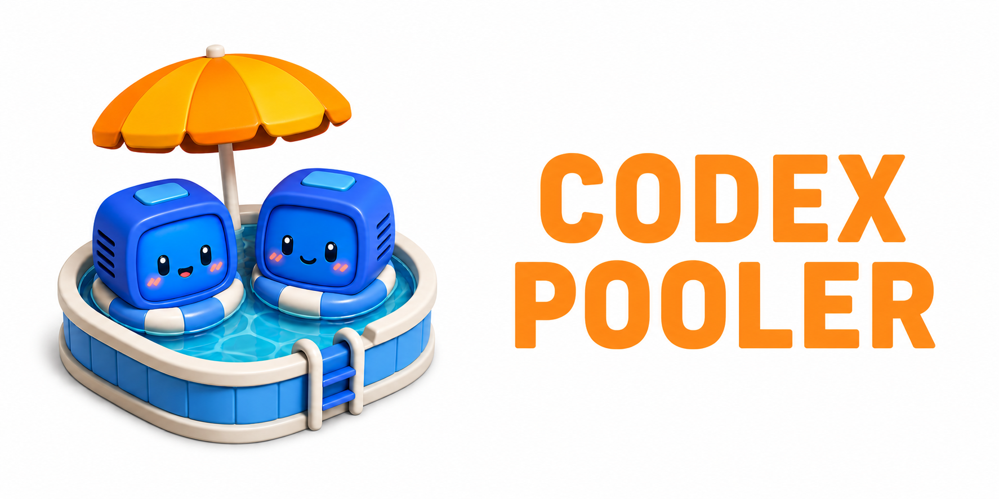

<h1 align="center">Codex Pooler</h1>

<p align="center">
  <strong>One gateway for many Codex accounts.</strong><br>
  Pool capacity, preserve sessions, route requests, and expose stable API keys
  for agents and tools.
</p>

<p align="center">
  <a href="#quick-start-with-docker-compose">Quick start</a>
  ·
  <a href="#harness-configuration">Harness</a>
  ·
  <a href="#configuration">Configuration</a>
  ·
  <a href="#deployment">Deployment</a>
</p>

<p align="center">
  
</p>

Codex Pooler is a self-hosted gateway for sharing Codex account capacity across
agents, tools, and teams.

Instead of binding each client to one Codex account, you add accounts to Pools
and issue stable Pool API keys. Clients send familiar Codex backend or
OpenAI-compatible requests; Codex Pooler selects the right account based on
model support, limits, session continuity, routing policy, and health.

Operators get one place to manage accounts, keys, routing, request accounting,
audit logs, and health without storing prompts, files, audio, images, bearer
tokens, or raw Codex secrets.

## Highlights

- **Account pools:** group several Codex accounts and expose them through one
  or more Pool API keys
- **Shared quota usage:** send work to accounts with available limits, so
  clients do not need to know which account still has capacity
- **Routing strategies:** choose how eligible accounts are ordered, including
  bridge-ring routing, deterministic rotation, least-recent-success preference,
  and quota-first ordering
- **Session continuity:** keep Codex response sessions and websocket reconnects
  attached to the right Codex account when the client provides stable session
  state
- **Codex backend compatibility:** serve the Codex backend route family under
  `/backend-api/*`, including responses, compact, usage, files, transcription,
  backend image proxy routes at `/backend-api/codex/images/generations` and
  `/backend-api/codex/images/edits`, selected account-management routes,
  explicit `/backend-api/codex/v1/models`, `/backend-api/codex/v1/responses`,
  `/backend-api/codex/v1/responses/compact`, and
  `/backend-api/codex/v1/chat/completions` aliases, plus canonical and v1
  websocket response streams
- **OpenAI SDK compatibility:** serve selected `/v1/*` endpoints and translate
  supported requests into Codex-compatible calls
- **Operator UI:** manage pools, Codex accounts, API keys, request logs, audit
  logs, jobs, stats, operators, and settings from authenticated `/admin/*`
  pages
- **Metadata-only MCP service:** expose read-only administrative metadata to
  operator-owned MCP clients through `/mcp` without mutation tools
- **Metadata-only observability:** record request and routing metadata without
  storing prompts, file bodies, audio, images, bearer tokens, cookies, raw
  Codex account tokens, or raw API keys

## Quick Start With Docker Compose

This runs the published release image with a local Postgres database. It is the
fastest way to try Codex Pooler on a laptop or small server.

Prerequisites:

- Docker with Compose
- `openssl`

Start Codex Pooler:

```bash
git clone https://github.com/icoretech/codex-pooler.git
cd codex-pooler

scripts/self-host/generate-env.sh
docker compose pull
docker compose up -d
```

Open `http://localhost:4000`. On the first visit, create the owner account at
`/bootstrap`, then sign in and start with `/admin/pools`.

Useful commands:

```bash
docker compose ps
docker compose logs -f app
docker compose down
```

To remove the local database too:

```bash
docker compose down -v
```

## First Runtime Setup

After bootstrap:

1. Create a Pool in `/admin/pools`
2. Import or connect Codex accounts in `/admin/upstreams`
3. Create a Pool API key in `/admin/api-keys`
4. Point Codex or SDK clients at one of the runtime base URLs:

Treat an imported Codex `auth.json` as owned by Codex Pooler after import. Do
not keep using the same `auth.json` from another Codex install, machine, or
automation unless you accept that provider refresh-token rotation can invalidate
one copy and move the account to `reauth_required`.

```text
Codex backend base URL: http://localhost:4000/backend-api/codex
OpenAI SDK base URL:    http://localhost:4000/v1
```

Use the generated Pool API key as the bearer token. That key represents the
Pool, not a single Codex account, so Codex Pooler can pick the best eligible
account for each request. Raw API keys are shown only once when created or
rotated.

## Harness Configuration

Keep Pool API keys and MCP tokens in environment variables when the harness
supports secret expansion. For desktop harnesses that persist remote MCP headers
in their own private settings, use a dedicated operator-scoped MCP token. For a
local instance, the runtime URLs are:

```text
Codex backend base URL: http://localhost:4000/backend-api/codex
OpenAI SDK base URL:    http://localhost:4000/v1
MCP URL:                http://localhost:4000/mcp
```

For a deployed instance, replace `http://localhost:4000` with your HTTPS host,
for example `https://pooler.example.com`.

<details>
<summary> OpenCode <code>~/.config/opencode/opencode.jsonc</code></summary>

opencode talks to Codex Pooler through the OpenAI-compatible `/v1` surface. The
provider uses the Pool API key, and the optional remote MCP entry uses an
operator-owned MCP token.

```jsonc
{
  "$schema": "https://opencode.ai/config.json",
  "provider": {
    "openai": {
      "npm": "@ai-sdk/openai",
      "name": "Codex Pooler",
      "options": {
        "baseURL": "http://localhost:4000/v1",
        "apiKey": "{env:CODEX_POOLER_API_KEY}",
        "reasoningEffort": "high",
        "reasoningSummary": "auto",
        "textVerbosity": "medium",
        "include": ["reasoning.encrypted_content"],
        "store": false
      },
      "models": {
        "gpt-5.5": {
          "id": "gpt-5.5",
          "name": "GPT-5.5",
          "family": "gpt",
          "attachment": true,
          "reasoning": true,
          "tool_call": true,
          "temperature": false,
          "modalities": {
            "input": ["text", "image"],
            "output": ["text"]
          },
          "limit": {
            "context": 400000,
            "input": 256000,
            "output": 128000
          }
        }
      }
    }
  },
  "mcp": {
    "codex_pooler": {
      "type": "remote",
      "url": "http://localhost:4000/mcp",
      "oauth": false,
      "headers": {
        "Authorization": "Bearer {env:CODEX_POOLER_MCP_KEY}"
      },
      "enabled": true,
      "timeout": 30000
    }
  }
}
```

Define only models that your assigned Pool can serve. For deployed instances,
change `baseURL` to `https://pooler.example.com/v1` and the MCP `url` to
`https://pooler.example.com/mcp`.

</details>

<details>
<summary> Codex <code>~/.codex/config.toml</code></summary>

Codex should use the backend compatibility route, not the `/v1` SDK route.
Keep the provider `name` as `OpenAI`; Codex uses that value for provider-family
behavior even when the request is routed through Codex Pooler.

```toml
model = "gpt-5.5"
model_provider = "codex-pooler-ws"

[model_providers.codex-pooler-ws]
name = "OpenAI"
base_url = "http://localhost:4000/backend-api/codex"
env_key = "CODEX_POOLER_API_KEY"
wire_api = "responses"
supports_websockets = true
requires_openai_auth = true

[model_providers.codex-pooler-http]
name = "OpenAI"
base_url = "http://localhost:4000/backend-api/codex"
env_key = "CODEX_POOLER_API_KEY"
wire_api = "responses"
supports_websockets = false
requires_openai_auth = true

[mcp_servers.codex_pooler]
url = "http://localhost:4000/mcp"
bearer_token_env_var = "CODEX_POOLER_MCP_KEY"
```

Use the websocket provider for normal Codex backend behavior, and keep the HTTP
provider when you need to force SSE-only coverage. For deployed instances,
change both `base_url` values to `https://pooler.example.com/backend-api/codex`
and the MCP `url` to `https://pooler.example.com/mcp`.

Codex filters resumable conversations by `model_provider`. If you already have
sessions created with the built-in `openai` provider and want them to appear
under `codex-pooler-ws`, re-tag both the JSONL transcripts and the newer SQLite
state database. Run these with Codex closed; they edit local state in place. The
transcript rewrite scans the whole sessions directory and can take a while on
large installs. Set `TO_PROVIDER=codex-pooler-http` if you made the HTTP
provider your default.

```bash
set -eu

FROM_PROVIDER="openai"
TO_PROVIDER="codex-pooler-ws"

find ~/.codex/sessions -type f -name '*.jsonl' \
  -exec perl -pi -e \
    "s/\"model_provider\":\"${FROM_PROVIDER}\"/\"model_provider\":\"${TO_PROVIDER}\"/g" \
    {} +

for db in ~/.codex/state_*.sqlite; do
  [ -e "$db" ] || continue
  sqlite3 "$db" \
    "UPDATE threads SET model_provider = '${TO_PROVIDER}' WHERE model_provider = '${FROM_PROVIDER}';"
done
```

On Windows, run the same migration from PowerShell. This expects `sqlite3` to be
available on `PATH`.

```powershell
$ErrorActionPreference = "Stop"

$FromProvider = "openai"
$ToProvider = "codex-pooler-ws"
$CodexHome = Join-Path $HOME ".codex"

$FromJson = '"model_provider":"' + $FromProvider + '"'
$ToJson = '"model_provider":"' + $ToProvider + '"'

Get-ChildItem -Path (Join-Path $CodexHome "sessions") -Recurse -Filter "*.jsonl" |
  ForEach-Object {
    $Path = $_.FullName
    $TempPath = "$Path.tmp"
    $Reader = [System.IO.StreamReader]::new($Path)
    $Writer = [System.IO.StreamWriter]::new(
      $TempPath,
      $false,
      [System.Text.UTF8Encoding]::new($false)
    )

    try {
      while (($Line = $Reader.ReadLine()) -ne $null) {
        $Writer.WriteLine($Line.Replace($FromJson, $ToJson))
      }
    } finally {
      $Reader.Dispose()
      $Writer.Dispose()
    }

    Move-Item -Force $TempPath $Path
  }

Get-ChildItem -Path $CodexHome -Filter "state_*.sqlite" |
  ForEach-Object {
    sqlite3 $_.FullName `
      "UPDATE threads SET model_provider = '$ToProvider' WHERE model_provider = '$FromProvider';"
  }
```

</details>

<details>
<summary> OpenClaw <code>~/.openclaw/openclaw.json</code></summary>

OpenClaw uses `openai/*` as the canonical OpenAI route. To keep that model name
while sending agent turns to Codex Pooler's OpenAI-compatible `/v1` surface, pin
the OpenAI provider to the PI runtime and point `baseUrl` at Codex Pooler.

```json5
{
  agents: {
    defaults: {
      model: { primary: "openai/gpt-5.5" },
    },
  },
  models: {
    mode: "merge",
    providers: {
      openai: {
        baseUrl: "http://localhost:4000/v1",
        apiKey: "${CODEX_POOLER_API_KEY}",
        api: "openai-responses",
        agentRuntime: { id: "pi" },
        timeoutSeconds: 300,
        models: [
          {
            id: "gpt-5.5",
            name: "GPT-5.5 via Codex Pooler",
            reasoning: true,
            input: ["text", "image"],
            contextWindow: 400000,
            contextTokens: 256000,
            maxTokens: 128000,
          },
        ],
      },
    },
  },
  mcp: {
    servers: {
      codex_pooler: {
        url: "http://localhost:4000/mcp",
        transport: "streamable-http",
        headers: {
          Authorization: "Bearer ${CODEX_POOLER_MCP_KEY}",
        },
      },
    },
  },
}
```

Define only models that your assigned Pool can serve. For deployed instances,
change `baseUrl` to `https://pooler.example.com/v1` and the MCP `url` to
`https://pooler.example.com/mcp`.

If you prefer to keep Codex Pooler separate from OpenClaw's built-in OpenAI
provider behavior, use a custom provider id such as `codex-pooler/gpt-5.5`
instead. That follows OpenClaw's generic custom-provider shape, but tools that
look specifically for `openai/gpt-*` model refs will not see it as canonical
OpenAI.

</details>

<details>
<summary> Hermes Agent <code>~/.hermes/config.yaml</code> + <code>auth.json</code></summary>

Hermes works best through its `openai-api` provider with the Responses transport
forced explicitly. Keep the Pool API key and MCP token in `~/.hermes/.env`,
point the provider config at Codex Pooler's `/v1` surface, and point
`mcp_servers` at `/mcp`.

```bash
OPENAI_API_KEY=<pool-api-key>
OPENAI_BASE_URL=http://localhost:4000/v1
CODEX_POOLER_MCP_KEY=<operator-mcp-token>
```

```yaml
model:
  default: gpt-5.5
  provider: openai-api
  base_url: http://localhost:4000/v1
  api_mode: codex_responses

mcp_servers:
  codex_pooler:
    url: http://localhost:4000/mcp
    headers:
      Authorization: "Bearer ${CODEX_POOLER_MCP_KEY}"
    enabled: true
    timeout: 120
    connect_timeout: 60
```

Smoke-test with a one-shot prompt:

```bash
hermes -z 'Reply with exactly: hermes openai api ok' --ignore-rules
```

Hermes can also be made to use its `openai-codex` provider against Codex
Pooler. This is less direct because Hermes treats `openai-codex` as an OAuth
provider by default; add a Pool API key credential ahead of any existing
device-code credential and keep the entry's `base_url` on `/v1`. This variant
stores the key in `auth.json` because Hermes credential pools live there.

```bash
HERMES_CODEX_BASE_URL=http://localhost:4000/v1
CODEX_POOLER_MCP_KEY=<operator-mcp-token>
```

```yaml
model:
  default: gpt-5.5
  provider: openai-codex
  base_url: http://localhost:4000/v1

mcp_servers:
  codex_pooler:
    url: http://localhost:4000/mcp
    headers:
      Authorization: "Bearer ${CODEX_POOLER_MCP_KEY}"
    enabled: true
    timeout: 120
    connect_timeout: 60
```

```json
{
  "active_provider": "openai-codex",
  "credential_pool": {
    "openai-codex": [
      {
        "label": "codex-pooler",
        "auth_type": "api_key",
        "priority": -10,
        "source": "manual",
        "access_token": "<pool-api-key>",
        "base_url": "http://localhost:4000/v1"
      }
    ]
  }
}
```

For deployed instances, change the model URLs to `https://pooler.example.com/v1`
and the MCP `url` to `https://pooler.example.com/mcp`.

</details>

<details>
<summary> Aider <code>~/.aider.conf.yml</code></summary>

Aider uses the OpenAI-compatible route with the `openai/` model prefix. Keep the
Pool API key in the environment and point Aider's OpenAI API base at Codex
Pooler's `/v1` surface.

```yaml
model: openai/gpt-5.5
openai-api-base: http://localhost:4000/v1
```

Smoke-test from a repository:

```bash
export OPENAI_API_KEY="$CODEX_POOLER_API_KEY"
aider --model openai/gpt-5.5 --message 'Reply with exactly: aider ok'
```

For deployed instances, change `openai-api-base` to
`https://pooler.example.com/v1`.

</details>

<details>
<summary> Continue <code>~/.continue/config.yaml</code></summary>

Continue can use Codex Pooler as an OpenAI-compatible provider by setting
`provider: openai`, `apiBase` to `/v1`, and the Pool API key as a Continue
secret. For `gpt-5*` models, Continue uses the Responses API by default.

```yaml
name: Codex Pooler
version: 1.0.0
schema: v1

models:
  - name: GPT-5.5 via Codex Pooler
    provider: openai
    model: gpt-5.5
    apiBase: http://localhost:4000/v1
    apiKey: "${{ secrets.CODEX_POOLER_API_KEY }}"
    roles:
      - chat
      - edit
      - apply
      - summarize
    capabilities:
      - tool_use
      - image_input

mcpServers:
  - name: codex_pooler
    type: streamable-http
    url: http://localhost:4000/mcp
    requestOptions:
      timeout: 30000
      headers:
        Authorization: "Bearer ${{ secrets.CODEX_POOLER_MCP_KEY }}"
```

For deployed instances, change `apiBase` to `https://pooler.example.com/v1` and
the MCP `url` to `https://pooler.example.com/mcp`.

</details>

<details>
<summary> Cline <code>~/.cline</code> + <code>~/.cline/mcp.json</code></summary>

Cline's OpenAI-compatible provider id is `openai`. Configure it with the Pool
API key, the Codex Pooler `/v1` base URL, and the model id that your assigned
Pool can serve.

```bash
cline auth \
  --provider openai \
  --apikey "$CODEX_POOLER_API_KEY" \
  --baseurl http://localhost:4000/v1 \
  --modelid gpt-5.5
```

For MCP in Cline CLI, add the remote server to `~/.cline/mcp.json`. The VS Code
extension opens its own MCP settings JSON from the Cline MCP Servers panel; use
the same `mcpServers` shape there.

```json
{
  "mcpServers": {
    "codex_pooler": {
      "url": "http://localhost:4000/mcp",
      "headers": {
        "Authorization": "Bearer <operator-mcp-token>"
      },
      "disabled": false,
      "autoApprove": []
    }
  }
}
```

For deployed instances, change `--baseurl` to `https://pooler.example.com/v1`
and the MCP `url` to `https://pooler.example.com/mcp`.

</details>

<details>
<summary> Roo Code VS Code settings + <code>.roo/mcp.json</code></summary>

Roo Code is configured from its VS Code settings panel. Select the
OpenAI-compatible provider and use the Codex Pooler `/v1` URL.

```text
API Provider: OpenAI Compatible
Base URL:     http://localhost:4000/v1
API Key:      ${CODEX_POOLER_API_KEY}
Model ID:     gpt-5.5
```

Roo Code supports project-level MCP configuration in `.roo/mcp.json`. This file
can be committed when it contains only the endpoint shape; keep the MCP token in
a private copy or configure it through the Roo MCP settings UI.

```json
{
  "mcpServers": {
    "codex_pooler": {
      "type": "streamable-http",
      "url": "http://localhost:4000/mcp",
      "headers": {
        "Authorization": "Bearer <operator-mcp-token>"
      },
      "disabled": false,
      "timeout": 300
    }
  }
}
```

For deployed instances, change the provider base URL to
`https://pooler.example.com/v1` and the MCP `url` to
`https://pooler.example.com/mcp`.

</details>

<details>
<summary> Goose <code>~/.config/goose/config.yaml</code></summary>

Goose's OpenAI provider supports OpenAI-compatible endpoints through
`OPENAI_HOST` and `OPENAI_BASE_PATH`. Point the host at Codex Pooler and keep the
Pool API key in the `OPENAI_API_KEY` environment variable or Goose's secret
storage.

```yaml
GOOSE_PROVIDER: openai
GOOSE_MODEL: gpt-5.5
OPENAI_HOST: http://localhost:4000
OPENAI_BASE_PATH: v1/chat/completions
```

For Codex Pooler MCP, add a remote Streamable HTTP extension. Goose stores
remote extension headers in its config, so use a dedicated MCP token.

```yaml
extensions:
  codex_pooler:
    enabled: true
    type: streamable_http
    name: codex_pooler
    uri: http://localhost:4000/mcp
    headers:
      Authorization: "Bearer <operator-mcp-token>"
    timeout: 300
    bundled: null
    available_tools: []
```

For deployed instances, change `OPENAI_HOST` to `https://pooler.example.com` and
the extension `uri` to `https://pooler.example.com/mcp`.

</details>

<details>
<summary> OpenAI Python SDK</summary>

OpenAI Python SDK clients can use the OpenAI-compatible `/v1` surface by setting
`base_url` to the Codex Pooler `/v1` URL and using the Pool API key as the API
key.

```python
import os

from openai import OpenAI

client = OpenAI(
    api_key=os.environ["CODEX_POOLER_API_KEY"],
    base_url="http://localhost:4000/v1",
)

response = client.responses.create(
    model="gpt-5.5",
    input="Write a one-sentence status update.",
)

print(response.output_text)
```

For deployed instances, change `base_url` to `https://pooler.example.com/v1`.

</details>

<details>
<summary> OpenAI Node SDK</summary>

OpenAI Node SDK clients use the same OpenAI-compatible `/v1` surface. Configure
`baseURL` with the Codex Pooler `/v1` URL and pass the Pool API key as the API
key.

```js
import OpenAI from "openai";

const client = new OpenAI({
  apiKey: process.env.CODEX_POOLER_API_KEY,
  baseURL: "http://localhost:4000/v1",
});

const response = await client.responses.create({
  model: "gpt-5.5",
  input: "Write a one-sentence status update.",
});

console.log(response.output_text);
```

For deployed instances, change `baseURL` to `https://pooler.example.com/v1`.

</details>

<details>
<summary> Vercel AI SDK</summary>

Vercel AI SDK can point its OpenAI provider at Codex Pooler by creating a custom
provider with `createOpenAI`. The provider calls the OpenAI-compatible `/v1`
surface with the Pool API key.

```ts
import { createOpenAI } from "@ai-sdk/openai";
import { generateText } from "ai";

const pooler = createOpenAI({
  apiKey: process.env.CODEX_POOLER_API_KEY,
  baseURL: "http://localhost:4000/v1",
});

const { text } = await generateText({
  model: pooler.responses("gpt-5.5"),
  prompt: "Write a one-sentence status update.",
});

console.log(text);
```

For deployed instances, change `baseURL` to `https://pooler.example.com/v1`.

</details>

## Runtime Compatibility

Codex Pooler supports two client-facing shapes:

- **Codex backend clients:** `/backend-api/codex/*`, `/backend-api/files`,
  `/backend-api/transcribe`, usage routes, and websocket response streams
- **OpenAI-style SDK clients:** `/v1/models`, `/v1/responses`,
  `/v1/chat/completions`, `/v1/files`, `/v1/audio/transcriptions`, and
  selected image endpoints

The `/v1` surface is compatibility, not a second engine. Supported requests are
translated into Codex-compatible calls, then routed through the same Pool rules,
limit checks, accounting, and account selection path.

## Operator MCP Service

Codex Pooler includes a metadata-only MCP endpoint at `/mcp` for trusted
operators who want an MCP host to inspect Pools, upstream accounts, Pool API key
metadata, operators, invites, request logs, audit logs, and MCP service status.
The service is read-only and has no mutation tools, but connected MCP hosts can
read administrative metadata, so only connect hosts you trust with that view.

MCP access uses operator-owned bearer MCP tokens, not Pool API keys, browser
sessions, cookies, query tokens, invite tokens, upstream tokens, or custom
headers. Operators manage their own MCP account gate and tokens from
`/admin/settings?tab=account`; the instance-wide service gate is managed from
`/admin/system`. Both gates must be enabled before a token works. Raw MCP tokens
are shown only once when created, and per-key usage tracking, counters, last IP,
and user-agent history are intentionally not stored.

The `/mcp` route inherits the runtime ingress IP allowlist and trusted-proxy
settings. If the allowlist is empty, the firewall is off; if it is configured,
the resolved client IP must match before MCP authentication or tool dispatch.

## Configuration

`scripts/self-host/generate-env.sh` writes a local `.env` with generated
secrets and local defaults. Keep that file private and don't reuse generated
values between public installs.

Environment variables are only for values the release needs before it can read
the database:

- `CODEX_POOLER_IMAGE` and `CODEX_POOLER_IMAGE_TAG`, the release image to run
- `CODEX_POOLER_HTTP_PORT`, the local host port, default `4000`
- `DATABASE_URL`, the Postgres connection used by the app
- `SECRET_KEY_BASE`, Phoenix signing and encryption secret
- `PHX_HOST`, `PORT`, and `PHX_SERVER`, Phoenix endpoint boot settings
- `OBAN_MODE` and `OBAN_JOBS_QUEUE_LIMIT`, release role and queue topology
- `DNS_CLUSTER_QUERY`, plus release distribution variables when clustering is on
- `CODEX_POOLER_TOTP_ENCRYPTION_KEY` and `CODEX_POOLER_TOTP_KEY_VERSION`, TOTP
  encryption root and version
- `CODEX_POOLER_UPSTREAM_SECRET_KEY` and
  `CODEX_POOLER_UPSTREAM_SECRET_KEY_VERSION`, upstream secret encryption root
  and version; the key must be 32 raw bytes or base64-encoded 32 bytes

Operational controls such as file limits, ingress trust, gateway diagnostics,
route-class admission, circuit thresholds, metrics auth, operator email, model
metadata, upstream timeouts, the OpenAI pricing catalog URL, and SMTP delivery
live in DB-managed Instance Settings under `/admin/system`. Live settings apply
to new runtime work through the settings cache. Cached settings reload after save
through PubSub invalidation; existing leases, in-flight requests, and already-open
streams keep the values they started with.

Secret Instance Settings stay write-only in the UI. The metrics bearer token is
stored only as a keyed HMAC digest, fingerprint, and key version. The SMTP
password is stored encrypted with key version metadata and is recovered only for
mail send or credential-test paths.

## Deployment

Docker Compose is the easiest way to try the software. For Kubernetes, this
repository also ships a Helm chart in `charts/codex-pooler` with separate app,
worker, scheduler, and migration roles. The chart expects an explicit immutable
image tag for real deployments. The chart defaults the web app to one replica
because backend websocket continuity owns a live upstream websocket in an app
pod. Owner-alive cross-node forwarding is wired, but scaling web replicas still
requires clustering, owner-forwarding, and the explicit unsafe topology
acknowledgement until Kubernetes smoke evidence relaxes that guard.

The Helm migration hook runs database migrations and imports the vendored OpenAI
pricing feed so request-log cost reporting has pricing snapshots after install
or upgrade. The scheduler also refreshes pricing hourly from the OpenAI pricing
catalog URL in Instance Settings, which defaults to
`https://icoretech.github.io/openai-json-pricing/pricing.json`.

## Local Development

Local development runs Phoenix on the host and Postgres through the dev compose
file:

```bash
make dev
```

`make dev` starts Postgres, prepares the database, imports the vendored OpenAI
pricing feed, and starts the Phoenix server on `http://localhost:4000`. Logs
are written to `tmp/dev-server.log`.

`mix ecto.setup` also loads a compact idempotent development operator baseline:
one owner on an empty database plus four example operators. All seeded operators
use `dev-password-123`.

To recreate a fuller fake dataset for exercising admin UI states without real
accounts or real request data, run:

```bash
mix dev.seed full
```

The full seed is idempotent and replaces only deterministic `dev-*` fake rows
owned by the development seed namespace. It includes active/disabled pools,
active/paused/revoked API keys, upstream accounts in active/refresh/reauth/paused
states, quota windows, request logs, invites, audit events, and job rows.

Common checks:

```bash
mix precommit
mix quality
docker compose -f docker-compose.dev.yml config
docker build .
helm template codex-pooler ./charts/codex-pooler
```
