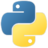
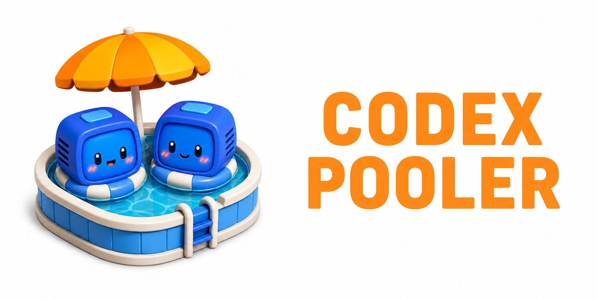
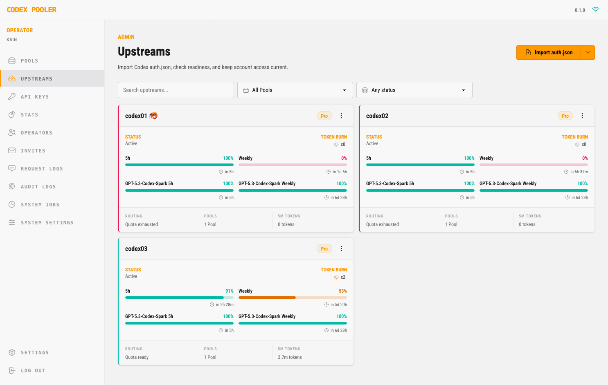
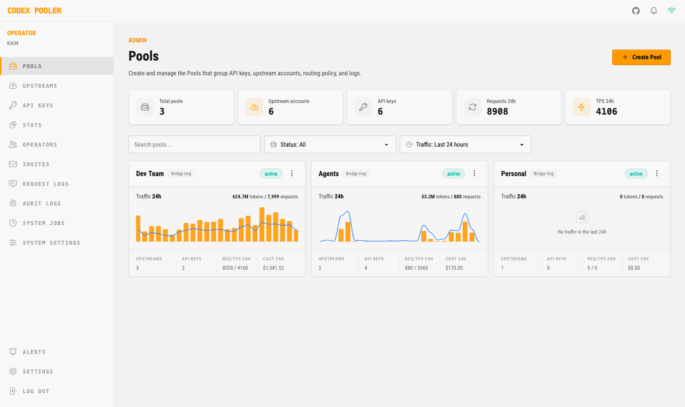
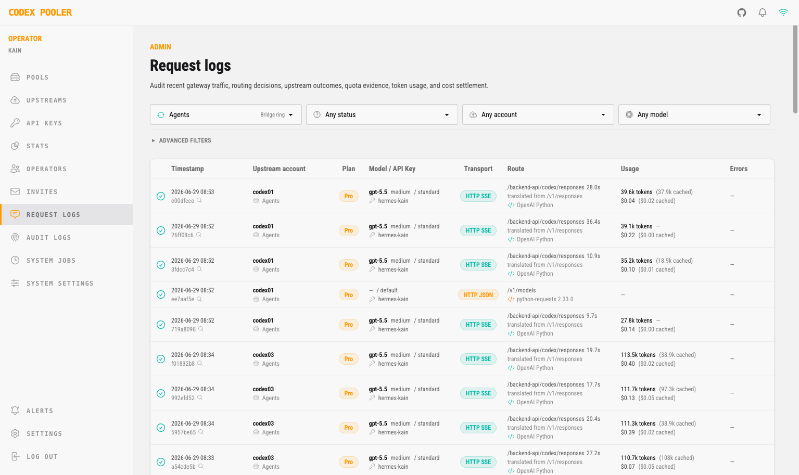

<h1 align="center">Codex Pooler</h1>

<p align="center">
  <strong>The full featured self-hosted Codex gateway, for teams, agents and you. Works with:</strong><br>
  <br>
  <a href="https://docs.codex-pooler.com/clients/opencode/" title="OpenCode"></a>
  <a href="https://docs.codex-pooler.com/clients/codex-cli/" title="Codex CLI and Codex Desktop"></a>
  <a href="https://docs.codex-pooler.com/clients/openclaw/" title="OpenClaw"></a>
  <a href="https://docs.codex-pooler.com/clients/hermes/" title="Hermes Agent"></a>
  <a href="https://docs.codex-pooler.com/clients/pi/" title="Pi"></a>
  <a href="https://docs.codex-pooler.com/clients/omp/" title="OMP"></a>
  <a href="https://docs.codex-pooler.com/clients/kilo/" title="Kilo"></a>
  <a href="https://docs.codex-pooler.com/clients/trae/" title="Trae"></a>
  <a href="https://docs.codex-pooler.com/clients/aider/" title="Aider"></a>
  <a href="https://docs.codex-pooler.com/clients/continue/" title="Continue"></a>
  <a href="https://docs.codex-pooler.com/clients/cline/" title="Cline"></a>
  <a href="https://docs.codex-pooler.com/clients/goose/" title="Goose"></a>
  <a href="https://docs.codex-pooler.com/clients/windmill/" title="Windmill AI"></a>
  <a href="https://docs.codex-pooler.com/clients/openhands/" title="OpenHands"></a>
  <a href="https://docs.codex-pooler.com/clients/openai-compatible/" title="OpenAI-compatible SDKs"></a>
  <a href="https://docs.codex-pooler.com/clients/openai-compatible/" title="OpenAI-compatible SDKs"></a>
  <a href="https://docs.codex-pooler.com/clients/openai-compatible/" title="Vercel AI SDK"></a>
</p>

<p align="center">
  <strong>English</strong>
  ·
  <a href="README.zh-CN.md">简体中文</a>
</p>

<p align="center">
  <a href="#quick-start-with-docker-compose">Quick start</a>
  ·
  <a href="#harness-configuration">Harness</a>
  ·
  <a href="#configuration">Configuration</a>
  ·
  <a href="#deployment">Deployment</a>
</p>

<p align="center">
  
</p>

<table>
  <tr>
    <td align="center" valign="top" width="33%">
      <a href=".github/assets/screen1.png">
        
      </a><br>
      <sub>Upstreams</sub>
    </td>
    <td align="center" valign="top" width="33%">
      <a href=".github/assets/screen2.png">
        
      </a><br>
      <sub>Pools</sub>
    </td>
    <td align="center" valign="top" width="33%">
      <a href=".github/assets/screen3.png">
        
      </a><br>
      <sub>Request logs</sub>
    </td>
  </tr>
</table>

Codex Pooler is a self-hosted gateway for running Codex-compatible agents,
tools, and automation through stable Pool API keys. It works with one upstream
Codex account for credential isolation, client normalization, metadata-only
operations, and saved reset visibility; add more accounts when you want shared
capacity and routing across eligible accounts.

Clients use one public model, `gemma3`, through Ollama, OpenAI-compatible,
Anthropic Messages, or Codex backend requests. Codex Pooler owns the private
target and reasoning policy, then selects an eligible account using quota
evidence, limits, session continuity, routing policy, and health. The Pool key
stays stable while upstream assignments, lifecycle state, reset policy, and
capacity change behind it.

Operators get one place to manage Pools, accounts, API keys, saved resets,
routing, request accounting, audit logs, and health without storing prompts,
files, audio, images, bearer tokens, or raw Codex secrets. Instance owners keep
the global administration surface, while instance admins work only with their
assigned Pools.

## Highlights

- 🔑 **Stable Pool API keys:** give clients one Pool credential whether the Pool
  currently has one upstream account or several, without distributing raw Codex
  account material
- 🎯 **Eligibility-aware routing:** route each request to an account with compatible
  model support, usable quota evidence, matching health, session state, and Pool
  policy
- 🧩 **Codex backend compatibility:** point Codex-compatible clients at Codex
  Pooler and keep responses, compacting, usage, files, audio, images, and
  backend websocket flows working through assigned accounts
- 🥸 **One immutable public model:** advertise only `gemma3`, ignore client model
  and effort selection, and keep provider, target, account, and assignment
  details behind the operator boundary
- 🦙 **Native Ollama and Anthropic adapters:** support Ollama JSON/NDJSON and
  Anthropic Messages JSON/SSE alongside the OpenAI and Codex route families
- 🔌 **OpenAI-compatible SDK surface:** let `/v1`-only apps and agent tools use
  Codex capacity through the same Pool boundary, with supported requests
  translated and routed to help contain API spend
- 🔁 **Session-aware websockets:** keep resumable Codex sessions and websocket
  reconnects attached to the right upstream account without translating backend
  websocket traffic through an HTTP compatibility layer
- ⚡ **Prompt-cache locality:** use a transient `prompt_cache_key` to prefer the
  same eligible upstream account for repeat stateless requests, improving
  provider-side cache locality without storing prompts or responses locally
- 🗜️ **Per-Pool request compression:** optionally compress upstream-bound
  Responses tool outputs before dispatch on supported request routes. The
  option is disabled by default, request-side only, and records safe aggregate
  savings without storing raw outputs.
- 🏦 **Saved reset management:** surface reported saved reset capacity on upstream
  accounts, show informational expirations when available, and let operators
  queue account-level recovery or opt into guarded auto-redemption policy
- 🚨 **Operator alerting:** define Pool-aware rules for capacity, upstream health,
  saved reset events, and delivery failures, then notify operators through
  admin incidents, email, or webhooks without exposing raw request content
- 🖥️ **Operator dashboard:** manage Pool-scoped accounts, API keys, invites, saved
  resets, usage, request logs, audit logs, MCP access, and the owner-only jobs,
  operators, and system settings surfaces
- 🔭 **Per-key Observatory:** switch on read-only Observatory access for any Pool
  API key and its holder gets a live, self-service dashboard of just that key's
  usage, models, latency, cache, and spend — a monitor-friendly view to keep on a
  second screen, with no operator controls or other keys in reach
- 🛡️ **Privacy-minded observability:** store request, routing, and audit metadata
  without storing prompts, file bodies, audio, images, bearer tokens, cookies,
  raw Codex account tokens, or raw API keys
- 🧱 **Runtime ingress firewall:** optionally restrict incoming runtime traffic to
  approved client networks for an extra deployment-level security boundary
- ⚙️ **Configurable without code changes:** tune Pool policy, gateway defaults,
  diagnostics, model support, limits, and operational settings from the admin UI
- 🐳 **Built for self-hosting:** run on Elixir/Erlang's fault-tolerant runtime,
  start locally with Docker Compose, or deploy the Helm chart with separate web,
  worker, scheduler, and migration roles for Kubernetes-friendly, multinode
  growth

## Harness Configuration

Every supported client configures the same public model:

```text
Model:                       gemma3
Ollama base URL:             http://localhost:4000
Anthropic/Claude base URL:   http://localhost:4000
OpenAI SDK base URL:         http://localhost:4000/v1
Codex backend base URL:      http://localhost:4000/backend-api/codex
```

Use a Pool API key for all runtime routes. Never give a client an upstream
account credential. For deployed instances, replace `http://localhost:4000`
with your origin.

Ollama discovery and chat:

```bash
curl -sS http://localhost:4000/api/tags \
  -H 'Authorization: Bearer <pool-api-key>'

curl -sS http://localhost:4000/api/chat \
  -H 'Authorization: Bearer <pool-api-key>' \
  -H 'Content-Type: application/json' \
  -d '{"model":"gemma3","messages":[{"role":"user","content":"hello"}],"stream":false}'
```

Claude Code:

```bash
export ANTHROPIC_BASE_URL="http://localhost:4000"
export ANTHROPIC_AUTH_TOKEN="<pool-api-key>"
export ANTHROPIC_API_KEY="<pool-api-key>"
export ANTHROPIC_MODEL="gemma3"
export ANTHROPIC_DEFAULT_HAIKU_MODEL="gemma3"
export ANTHROPIC_DEFAULT_SONNET_MODEL="gemma3"
export ANTHROPIC_DEFAULT_OPUS_MODEL="gemma3"
export CLAUDE_CODE_DISABLE_NONESSENTIAL_TRAFFIC=1
claude --model gemma3 --effort max
```

Codex CLI (`CODEX_HOME/config.toml`):

```toml
model = "gemma3"
model_provider = "codex-pooler"
model_reasoning_effort = "max"

[model_providers.codex-pooler]
name = "OpenAI"
base_url = "http://localhost:4000/backend-api/codex"
env_key = "CODEX_POOLER_API_KEY"
wire_api = "responses"
supports_websockets = true
requires_openai_auth = false
```

OpenAI SDK clients use `http://localhost:4000/v1`, a Pool API key as the bearer
credential, and `gemma3` in the model field. See the dedicated [Ollama](https://docs.codex-pooler.com/clients/ollama/),
[Claude Code](https://docs.codex-pooler.com/clients/claude-code/),
[OpenAI-compatible](https://docs.codex-pooler.com/clients/openai-compatible/),
and [Codex CLI](https://docs.codex-pooler.com/clients/codex-cli/) guides for
complete setup and compatibility boundaries.

The server normalizes model and reasoning selectors before routing. Clients see
only `gemma3`; authorized operator diagnostics retain truthful, sanitized
routing and accounting metadata. Cache/session inputs are scoped to the Pool
and API key and improve locality only—they do not create a response cache or
guarantee a provider cache hit.

Run the protocol, SDK, Codex CLI, and Claude Code deployment gate with:

```bash
FACADE_BASE_URL=http://127.0.0.1:4000 \
FACADE_POOL_API_KEY='<pool-api-key>' \
bash scripts/verification/facade/run-live-clients.sh
```


## Quick Start With Docker Compose

This runs the published release image with a local Postgres database. It is the
fastest way to try Codex Pooler on a laptop or small server.
For normal use, run a versioned, tagged stable release from [GitHub Releases](https://github.com/icoretech/codex-pooler/releases). The `latest` image tag follows the most recently published release, but a version tag keeps the installation reproducible; run from source only in [Local Development](#local-development).

Prerequisites:

- Docker with Compose
- Git, if you are cloning the repository
- `openssl`

Start Codex Pooler:

```bash
git clone https://github.com/icoretech/codex-pooler.git
cd codex-pooler

# Run the latest tagged stable release. Find its version at
# https://github.com/icoretech/codex-pooler/releases, then substitute it here.
export CODEX_POOLER_IMAGE_TAG=<release-tag>

scripts/self-host/generate-env.sh
docker compose pull
docker compose up -d
```

The first run pulls the app and Postgres images, waits for Postgres health, runs
the migration container, then starts the web app.

Open `http://localhost:4000`. On the first visit, create the owner account at
`/bootstrap`, then sign in and start with `/admin/pools`.

To verify the first-run redirect before opening a browser:

```bash
curl -sS -D - -o /dev/null http://localhost:4000/ | grep -i '^location: /bootstrap'
curl -fsS http://localhost:4000/bootstrap/status
```

The status endpoint should return `{"status":"ok","bootstrap":"pending"}` on a
fresh database.

Useful commands:

```bash
docker compose ps
docker compose logs -f app
docker compose down
```

To upgrade an existing Compose install, set `CODEX_POOLER_IMAGE_TAG` in `.env`
to the target tagged stable release, then run:

```bash
docker compose pull
docker compose up -d
```

The Compose stack has a one-shot `migrate` service. It waits for Postgres, runs
release migrations, imports the bundled pricing snapshot, and exits before the
web app starts. Normal app boot does not migrate the database by itself. If a
failed migration needs to be rerun after fixing configuration or database
access, run:

```bash
docker compose up -d db
docker compose run --rm migrate
docker compose up -d app
```

Use `http://localhost:4000` for the default Compose stack even if the Phoenix
startup banner prints an endpoint URL such as `https://localhost`; the Compose
port mapping is the local URL to open. The release image includes the OS
timezone database used for operator timezone display.

To remove the local database too:

```bash
docker compose down -v
```

## First Runtime Setup

After bootstrap:

1. Create a Pool in `/admin/pools`
2. Link, import, or invite one or more Codex accounts in `/admin/upstreams`
3. Create a Pool API key in `/admin/api-keys`
4. Point a supported client at its runtime base URL and configure only `gemma3`:

One upstream account is enough for a working setup. Additional upstreams expand
the same Pool into shared capacity without changing client credentials.

Prefer `OAuth` in `/admin/upstreams` for new operator-managed upstream
accounts when browser authorization is practical. The admin dialog links the
account, stores resulting credential material through encrypted upstream secret
storage, and stays metadata-only after completion. Use `Import` only when an
existing Codex `auth.json` is the right source of credentials.

Treat an imported Codex `auth.json` as owned by Codex Pooler after import. Do
not keep using the same `auth.json` from another Codex install, machine, or
automation unless you accept that provider refresh-token rotation can invalidate
one copy and move the account to `reauth_required`.

Hosted invite onboarding and the OAuth device-code fallback use OpenAI's Codex
device-code authorization. This setup is only needed for hosted invites and the
OAuth device-code fallback; browser OAuth linking does not depend on it. For a
personal ChatGPT account, open `chatgpt.com`, go to Settings > Security, and enable
`Enable device code authorization for Codex`. For workspace-managed accounts,
ask a workspace admin to enable device-code login for Codex in the workspace
permissions. OpenAI's [Codex authentication docs](https://developers.openai.com/codex/auth)
describe device-code login. The invite or fallback flow can fail at the OpenAI
approval step when device-code authorization is off.

```text
Ollama base URL:           http://localhost:4000
Anthropic base URL:        http://localhost:4000
OpenAI SDK base URL:       http://localhost:4000/v1
Codex backend base URL:    http://localhost:4000/backend-api/codex
Public model for all:      gemma3
```

Use the generated Pool API key as the bearer token. That key represents the
Pool, not a single Codex account, so Codex Pooler can pick the best eligible
account for each request. Raw API keys are shown only once when created or
rotated.

## Operator Roles

The first bootstrap account is an `instance_owner`. Owners have instance-wide
administration access: they create Pools, assign operators to Pools, manage
operators, inspect global jobs, and change system settings.

Additional operators can be owners or `instance_admin`s. Instance admins are
Pool-scoped: they can work only with active Pools assigned to them and metadata
derived from those Pools. If no Pools are assigned, the admin UI shows empty
Pool-scoped states instead of exposing global data. Archiving or deleting a Pool
removes future instance-admin visibility for that Pool; historical request and
audit rows for archived or deleted Pools remain owner-only.

## Runtime Compatibility

Use the client guides when wiring a specific tool. Clients pick one of four
public protocol shapes:

- **Ollama clients** use the instance root and native `/api` discovery,
  chat, generation, and NDJSON routes.
- **Anthropic and Claude Code clients** use the instance root and the bounded
  `/v1/messages` adapter.
- **Codex backend clients** use `/backend-api/codex` for Codex-native behavior
  such as sessions, compacting, files, audio, images, and backend websockets.
- **OpenAI-compatible clients** use `/v1` for supported SDK-style Responses,
  chat, completions, files, audio, image, and model-list calls.

All paths authenticate with Pool API keys, advertise only `gemma3`, and route
reasoning work through the same fixed server policy and Pool
policy, account health, model support, quota evidence, session continuity, and
metadata-only accounting. Codex Pooler is intentionally not a wildcard OpenAI
or vendor API proxy; unsupported areas fail predictably. For exact route details, use the
[Runtime Routes](https://docs.codex-pooler.com/reference/runtime-routes/)
reference and the
[OpenAI-compatible client guide](https://docs.codex-pooler.com/clients/openai-compatible/).

## Operator MCP Service

Codex Pooler includes an optional metadata-only MCP endpoint at `/mcp` for
trusted operators who want an MCP host to inspect Pools, upstream accounts, Pool
API key metadata, operators, invites, request logs, audit logs, and MCP service
status. This operator add-on is not required for Codex Pooler runtime clients.
The service is read-only and has no mutation tools. It uses the same owner vs
assigned-Pool visibility model as the admin UI, but connected MCP hosts can read
the metadata visible to that operator, so only connect hosts you trust with that
view.

MCP access uses operator-owned bearer MCP tokens, not Pool API keys, browser
sessions, cookies, query tokens, invite tokens, upstream tokens, or custom
headers. Operators manage their own MCP account gate and tokens from
`/admin/settings?tab=account`; the instance-wide service gate is managed from
`/admin/system`. Both gates must be enabled before a token works. Raw MCP tokens
are shown only once when created, and per-key usage tracking, counters, last IP,
and user-agent history are intentionally not stored.

The `/mcp` route inherits the runtime ingress IP allowlist and trusted-proxy
settings. If the allowlist is empty, the firewall is off; if it is configured,
the resolved client IP must match before MCP authentication or tool dispatch.

## Configuration

`scripts/self-host/generate-env.sh` writes a local `.env` with generated
secrets and local defaults. Keep that file private and don't reuse generated
values between public installs.

Environment variables are only for values the release needs before it can read
the database:

- `CODEX_POOLER_IMAGE` and `CODEX_POOLER_IMAGE_TAG`, the release image to run
- `CODEX_POOLER_HTTP_PORT`, the local host port, default `4000`
- `DATABASE_URL`, the Postgres connection used by the app
- `SECRET_KEY_BASE`, Phoenix signing and encryption secret
- `PHX_HOST`, `PORT`, and `PHX_SERVER`, HTTP endpoint boot settings
- `OBAN_MODE` and `OBAN_JOBS_QUEUE_LIMIT`, release role and queue topology
- `DNS_CLUSTER_QUERY`, plus release distribution variables when clustering is on
- `CODEX_POOLER_TOTP_ENCRYPTION_KEY` and `CODEX_POOLER_TOTP_KEY_VERSION`, TOTP
  encryption root and version
- `CODEX_POOLER_UPSTREAM_SECRET_KEY` and
  `CODEX_POOLER_UPSTREAM_SECRET_KEY_VERSION`, upstream secret encryption root
  and version; the key must be 32 raw bytes or base64-encoded 32 bytes

Operational controls such as file limits, ingress trust, gateway diagnostics,
route-class admission, circuit thresholds, metrics auth, operator email, model
metadata, upstream timeouts, the OpenAI pricing catalog URL, and SMTP delivery
live in DB-managed Instance Settings under `/admin/system`. Live settings apply
to new runtime work through the settings cache. Cached settings reload after save
through PubSub invalidation; existing leases, in-flight requests, and already-open
streams keep the values they started with.

Secret Instance Settings stay write-only in the UI. The metrics bearer token is
stored only as a keyed HMAC digest, fingerprint, and key version. The SMTP
password is stored encrypted with key version metadata and is recovered only for
mail send or credential-test paths.

## Deployment

Choose the deployment path that matches how you want to operate Codex Pooler:

| Path | Use it for | Start here |
| --- | --- | --- |
| Docker Compose | A quick self-hosted install on a laptop, lab server, or small single node | [Docker Compose deployment guide](https://docs.codex-pooler.com/deployment/docker-compose/) |
| Kubernetes | Production installs, managed ingress, external Postgres, metrics, and separate runtime roles | [Helm deployment guide](https://docs.codex-pooler.com/deployment/helm/) |

The Kubernetes path uses the
[`icoretech/codex-pooler` chart](https://github.com/icoretech/helm/tree/main/charts/codex-pooler)
from the iCoreTech Helm repository. The chart runs one release image as separate
web, worker, scheduler, and migration roles. For a real install, pin the chart
`--version`; the chart defaults `image.tag` to the matching `appVersion`.

## Need more Codex?

👉 [codex-action](https://github.com/icoretech/codex-action) runs OpenAI Codex
CLI non-interactively in GitHub Actions workflows

👉 [codex-docker](https://github.com/icoretech/codex-docker) provides a
multi-arch OpenAI Codex CLI Docker image built from official upstream releases

## Local Development

Local development runs Phoenix on the host and Postgres through the dev compose
file:

```bash
make dev
```

`make dev` starts Postgres, prepares the database, imports the vendored OpenAI
pricing feed, and starts the Phoenix server on `http://localhost:4000`. Logs
are written to the local development server log.

Development seeds are optional and only run through the explicit seed task. To
create a compact idempotent operator baseline with one owner plus four example
operators, run:

```bash
mix dev.seed compact
```

All seeded operators use `dev-password-123`.

To recreate a fuller fake dataset for exercising admin UI states without real
accounts or real request data, run:

```bash
mix dev.seed full
```

The full seed is idempotent and replaces only deterministic `dev-*` fake rows
owned by the development seed namespace. It includes active/disabled pools,
active/paused/revoked API keys, upstream accounts in active/refresh/reauth/paused
states, quota windows, request logs, invites, audit events, and job rows.

Common checks:

```bash
mix precommit
mix quality
docker compose -f docker-compose.dev.yml config
docker build .
```

Helm chart validation lives with the published chart in the iCoreTech Helm
repository when Kubernetes deployment behavior or values change.

`mix test` and `mix precommit` serialize database-backed test runs with a
PostgreSQL advisory lock keyed by the configured test database, so concurrent
local runs wait instead of deadlocking the shared sandbox database.
