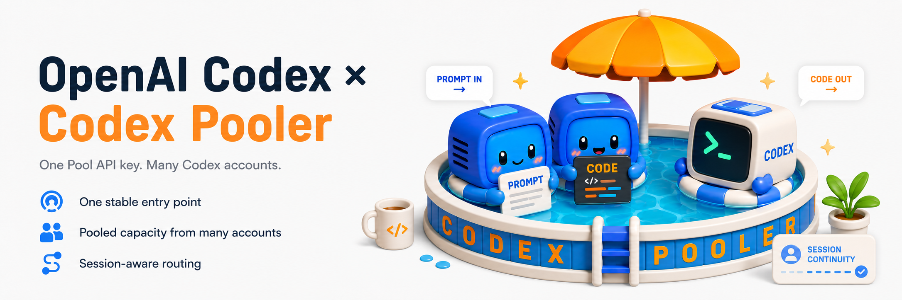
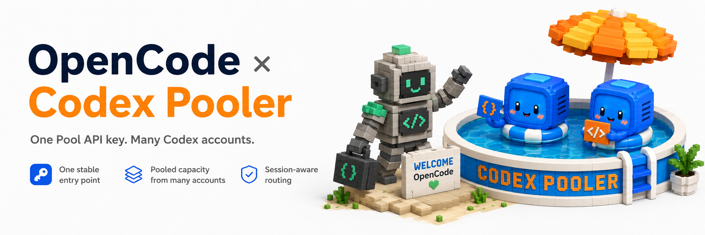
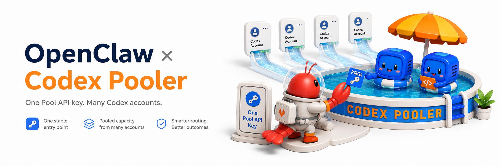
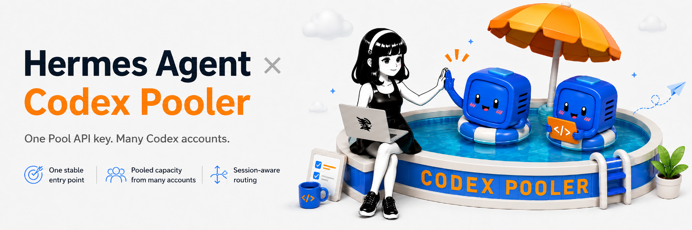
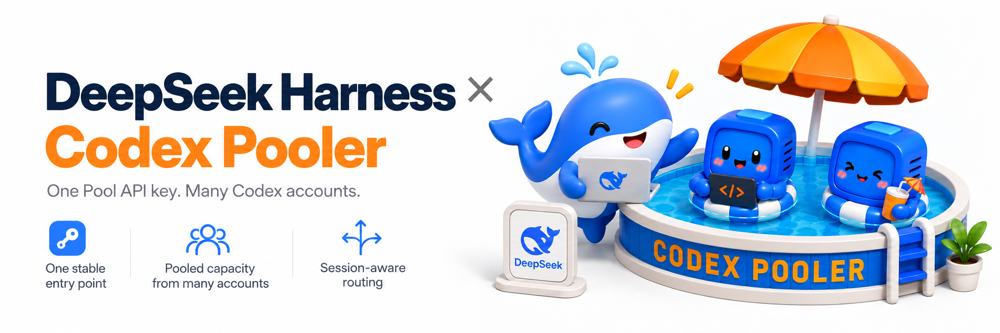
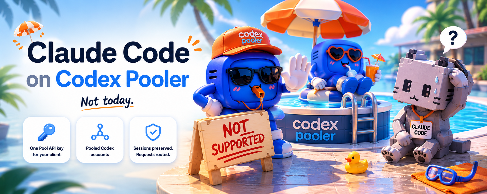

<h1 align="center">Codex Pooler</h1>

<p align="center">
  <strong>面向团队、Agent 和个人的完整自托管 Codex 网关。支持：</strong><br>
  <br>
  <a href="https://docs.codex-pooler.com/clients/codex-cli-desktop/" title="Codex CLI and Codex Desktop"></a>
  <a href="#opencode-setup" title="OpenCode"></a>
  <a href="https://docs.codex-pooler.com/clients/openclaw/" title="OpenClaw"></a>
  <a href="https://docs.codex-pooler.com/clients/hermes/" title="Hermes Agent"></a>
  <a href="https://docs.codex-pooler.com/clients/pi/" title="Pi"></a>
  <a href="https://docs.codex-pooler.com/clients/omp/" title="OMP"></a>
  <a href="https://docs.codex-pooler.com/clients/cursor/" title="Cursor"></a>
  <a href="https://docs.codex-pooler.com/clients/kilo-code/" title="Kilo Code"></a>
  <a href="https://docs.codex-pooler.com/clients/trae/" title="Trae"></a>
  <a href="https://docs.codex-pooler.com/clients/aider/" title="Aider"></a>
  <a href="https://docs.codex-pooler.com/clients/continue/" title="Continue"></a>
  <a href="https://docs.codex-pooler.com/clients/cline/" title="Cline"></a>
  <a href="https://docs.codex-pooler.com/clients/goose/" title="Goose"></a>
  <a href="https://docs.codex-pooler.com/clients/deepseek-harness/" title="DeepSeek Harness"></a>
  <a href="https://docs.codex-pooler.com/clients/windmill/" title="Windmill AI"></a>
  <a href="https://docs.codex-pooler.com/clients/openhands/" title="OpenHands"></a>
  <a href="https://docs.codex-pooler.com/clients/openai-compatible/" title="OpenAI-compatible SDKs"></a>
  <a href="https://docs.codex-pooler.com/clients/openai-compatible/" title="OpenAI-compatible SDKs"></a>
  <a href="https://docs.codex-pooler.com/clients/openai-compatible/" title="Vercel AI SDK"></a>
</p>

<p align="center">
  <a href="README.md">English</a>
  ·
  <strong>简体中文</strong>
</p>

<p align="center">
  <a href="#quick-start-with-docker-compose">快速开始</a>
  ·
  <a href="#harness-configuration">客户端配置</a>
  ·
  <a href="#configuration">配置</a>
  ·
  <a href="#deployment">部署</a>
  ·
  <a href="https://x.com/icoretech_inc">X</a>
  ·
  <a href="https://reddit.com/r/CodexPooler">Reddit</a>
</p>

<p align="center">
  
</p>

<table>
  <tr>
    <td align="center" valign="top" width="33%">
      <a href=".github/assets/screen1.png">
        
      </a><br>
      <sub>上游账号</sub>
    </td>
    <td align="center" valign="top" width="33%">
      <a href=".github/assets/screen2.png">
        
      </a><br>
      <sub>Pools</sub>
    </td>
    <td align="center" valign="top" width="33%">
      <a href=".github/assets/screen3.png">
        
      </a><br>
      <sub>请求日志</sub>
    </td>
  </tr>
</table>

Codex Pooler 是一个自托管网关，用稳定的 Pool API 密钥运行兼容 Codex
的 Agent、工具和自动化。它可以只连接一个上游 Codex 账号，用于凭据隔离、
客户端规范化、仅保存元数据的操作，以及已保存 reset 的可见性；当你需要在多个
合格账号之间共享容量和路由时，可以继续添加更多账号。

客户端发送熟悉的 Codex 后端请求或 OpenAI 兼容请求；Codex Pooler
会根据模型支持、额度证据、限制、会话连续性、路由策略和健康状态选择合格
账号。Pool 密钥保持稳定，而它背后的上游分配、生命周期状态、reset 策略和
容量可以变化。

运营者可以在一个地方管理 Pools、账号、API 密钥、已保存的 resets、路由、
请求计费、审计日志和健康状态，同时不存储提示词、文件、音频、图片、
Bearer 令牌或原始 Codex 密钥。实例所有者保留全局管理界面，实例
管理员只处理分配给自己的 Pools。

## 亮点

- 🧩 **继续使用熟悉的工具：** 连接 Codex、OpenCode 和其他受支持的编程 Agent，
  以及使用 OpenAI 兼容 SDK 构建的应用
- 🔑 **一个密钥连接你的应用：** 使用稳定的 Pool API 密钥连接工具，添加或更换
  Codex 账号时无需更改密钥，也不用分享账号凭据
- ⚡ **跨协议的高缓存复用率：** 在已观测的 HTTP/SSE 和 WebSocket 工作负载中，
  超过 95% 的输入来自缓存，由优先复用缓存的路由和连接复用提供支持
- 🎯 **自动选择账号：** 将请求发送给能够提供所选模型的账号，同时考虑可用额度
  和账号状态
- 📏 **控制每个密钥的用量：** 设置请求限制以及每日或每周的 AI 使用额度
- 🚀 **让 Agent 发挥更多能力：** Full 模式支持同时使用多个工具，并在需要时
  提供 Lite 兼容性
- 🖼️ **不止文字聊天：** 在受支持的应用中使用同一个 Pool API 密钥生成或编辑图片，
  以及将音频转录为文字
- 🛡️ **保护对话内容：** 记录用量和排查请求问题，无需保存提示词、回复、
  上传的文件、图片或音频
- 🔁 **保持会话连续：** 客户端重新连接时，让受支持的会话保持关联到正确的账号
- 🔭 **让用户查看自己的用量：** 为每个密钥开启专属 Observatory 仪表盘，
  查看活动、响应时间和估算费用
- 🏦 **用好已保存的重置机会：** 查看可用的额度重置次数，手动使用，
  或启用自动使用来恢复账号额度
- 🖥️ **在一个地方完成管理：** 通过浏览器添加账号、管理密钥和邀请、查看用量，
  并调整设置
- 👥 **按团队和项目管理：** 将账号分组到不同的 Pool，为每个 Pool 设置访问规则
  和可用模型
- 🤝 **通过邀请连接账号：** 账号持有者可以在浏览器中按步骤加入 Pool，
  无需向你发送凭据文件
- 🚨 **及时发现需要处理的问题：** 在仪表盘、邮件或 webhook 中接收容量不足、
  账号异常和额度重置事件的告警
- 🗜️ **发送更精简的请求：** 可选择在向 AI 服务商发送请求前缩减受支持的工具输出，
  并查看节省了多少内容
- 🧷 **补齐缺失的会话标识：** 客户端未直接发送所需标识时，根据其缓存键
  或对话 ID 自动生成稳定的会话标识
- 🧱 **决定谁能连接：** 可选择仅允许来自获准网络的请求
- 🐳 **运行在自己的基础设施上：** 从 Docker Compose 起步，随需求增长
  部署到 Kubernetes

<a id="harness-configuration"></a>

## 客户端配置

准备好运行中的 Codex Pooler 实例、Pool API 密钥和已安装的客户端。
示例包含 `gpt-6-luna`、`gpt-6-sol` 和 `gpt-6-astra`，默认选择 Sol。
请保留你的 Pool 提供的模型。
将 `<pool-api-key>` 替换为你的密钥，在启动客户端前运行对应终端的命令。

**macOS / Linux / Windows WSL（bash 或 zsh）**

```bash
export CODEX_POOLER_API_KEY="<pool-api-key>"
```

**Windows PowerShell**

```powershell
$env:CODEX_POOLER_API_KEY = "<pool-api-key>"
```

以上命令仅为当前终端设置密钥。桌面应用请按对应指南保存 API 密钥。

下方列出默认路径。在 macOS/Linux 上，`~` 表示用户主目录。
在 Windows 上，将以 `%USERPROFILE%`、`%APPDATA%` 或 `%LOCALAPPDATA%`
开头的路径粘贴到文件资源管理器地址栏。如果客户端安装在 WSL 中，
请在 WSL 内使用 Linux 路径和命令。自定义配置目录或配置档优先于这些默认路径。

本地实例使用以下地址：

| 客户端 | 基础 URL |
| --- | --- |
| Codex CLI / Desktop | `http://localhost:4000/backend-api/codex` |
| 其他客户端和 SDK | `http://localhost:4000/v1` |

对于已部署实例，将 `http://localhost:4000` 替换为实例主机，
例如 `https://codex-pooler.example.com`。将示例合并到现有配置。
GPT-6 示例使用 **828,400 token 的大上下文**。
Codex CLI 和 Desktop 会自动读取 Pool 提供的上下文大小。

每节只说明基本连接配置。**完整配置与扩展选项**链接提供安装、进阶选项和故障排查说明。
运营者 MCP 为可选功能，使用独立令牌；参见[运营者 MCP 服务](#运营者-mcp-服务)。

<details>
<summary> Codex CLI and Codex Desktop <code>config.toml</code></summary>



| 系统 | 配置文件 |
| --- | --- |
| macOS / Linux | `~/.codex/config.toml` |
| Windows | `%USERPROFILE%\.codex\config.toml` |

打开对应系统路径下的 `config.toml`，添加以下配置。如果设置了 `CODEX_HOME`，
请使用该文件夹中的文件。如果已有 `[features]` 节，请将设置添加到现有节中。

```toml
model = "gpt-6-sol"
model_provider = "codex-pooler-ws"

[model_providers.codex-pooler-ws]
name = "OpenAI"
base_url = "http://localhost:4000/backend-api/codex"
model_catalog_url = "http://localhost:4000/backend-api/codex/models"
env_key = "CODEX_POOLER_API_KEY"
wire_api = "responses"
supports_websockets = true
requires_openai_auth = true

[features]
api_key_model_discovery = true
```

重启 Codex，选择你的 Pool 提供的模型。
使用 Codex Desktop 时，
请按完整指南设置 API 密钥，使应用能够读取它。

**[完整配置与扩展选项](https://docs.codex-pooler.com/clients/codex-cli-desktop/)** — 桌面应用配置、账户设置和现有会话。

</details>

<a id="opencode-setup"></a>

<details>
<summary> OpenCode <code>opencode.jsonc</code></summary>



| 系统 | 配置文件 |
| --- | --- |
| macOS / Linux | `~/.config/opencode/opencode.jsonc` |
| Windows | `%USERPROFILE%\.config\opencode\opencode.jsonc` |

打开对应系统路径下的 `opencode.jsonc`，添加下方对应 OpenCode 版本的配置。

**OpenCode v2**

```jsonc
{
  "$schema": "https://opencode.ai/config.json",
  "model": "codex-pooler/gpt-6-sol",
  "agents": {
    "title": {
      "model": "codex-pooler/gpt-6-luna"
    }
  },
  "providers": {
    "codex-pooler": {
      "package": "@opencode/ai/providers/openai/responses",
      "settings": {
        "baseURL": "http://localhost:4000/v1",
        "apiKey": "{env:CODEX_POOLER_API_KEY}",
        "transport": "http",
        "compaction": {
          "type": "summary"
        }
      },
      "models": {
        "gpt-6-luna": {
          "modelID": "gpt-6-luna",
          "capabilities": {
            "tools": true,
            "input": ["text", "image"],
            "output": ["text"]
          },
          "limit": { "context": 828400, "input": 828400, "output": 32000 },
          "settings": {
            "reasoningEffort": "high",
            "reasoningSummary": "auto"
          }
        },
        "gpt-6-sol": {
          "modelID": "gpt-6-sol",
          "capabilities": {
            "tools": true,
            "input": ["text", "image"],
            "output": ["text"]
          },
          "limit": { "context": 828400, "input": 828400, "output": 32000 },
          "settings": {
            "reasoningEffort": "high",
            "reasoningSummary": "auto"
          }
        },
        "gpt-6-astra": {
          "modelID": "gpt-6-astra",
          "capabilities": {
            "tools": true,
            "input": ["text", "image"],
            "output": ["text"]
          },
          "limit": { "context": 828400, "input": 828400, "output": 32000 },
          "settings": {
            "reasoningEffort": "high",
            "reasoningSummary": "auto"
          }
        }
      }
    }
  }
}
```

**[OpenCode v2 完整配置与扩展选项](https://docs.codex-pooler.com/clients/opencode-v2/)** — 安装和进阶选项。

**OpenCode v1**

```jsonc
{
  "$schema": "https://opencode.ai/config.json",
  "model": "openai/gpt-6-sol",
  "small_model": "openai/gpt-6-luna",
  "provider": {
    "openai": {
      "npm": "@ai-sdk/openai",
      "name": "Codex Pooler",
      "options": {
        "baseURL": "http://localhost:4000/v1",
        "apiKey": "{env:CODEX_POOLER_API_KEY}"
      },
      "models": {
        "gpt-6-luna": {
          "id": "gpt-6-luna",
          "name": "GPT-6 Luna",
          "family": "gpt",
          "attachment": true,
          "reasoning": true,
          "tool_call": true,
          "temperature": false,
          "options": {
            "reasoningEffort": "high",
            "reasoningSummary": "auto",
            "include": ["reasoning.encrypted_content"]
          },
          "modalities": {
            "input": ["text", "image"],
            "output": ["text"]
          },
          "limit": { "context": 828400, "input": 828400, "output": 64000 }
        },
        "gpt-6-sol": {
          "id": "gpt-6-sol",
          "name": "GPT-6 Sol",
          "family": "gpt",
          "attachment": true,
          "reasoning": true,
          "tool_call": true,
          "temperature": false,
          "options": {
            "reasoningEffort": "high",
            "reasoningSummary": "auto",
            "include": ["reasoning.encrypted_content"]
          },
          "modalities": {
            "input": ["text", "image"],
            "output": ["text"]
          },
          "limit": { "context": 828400, "input": 828400, "output": 64000 }
        },
        "gpt-6-astra": {
          "id": "gpt-6-astra",
          "name": "GPT-6 Astra",
          "family": "gpt",
          "attachment": true,
          "reasoning": true,
          "tool_call": true,
          "temperature": false,
          "options": {
            "reasoningEffort": "high",
            "reasoningSummary": "auto",
            "include": ["reasoning.encrypted_content"]
          },
          "modalities": {
            "input": ["text", "image"],
            "output": ["text"]
          },
          "limit": { "context": 828400, "input": 828400, "output": 64000 }
        }
      }
    }
  }
}
```

**[OpenCode v1 完整配置与扩展选项](https://docs.codex-pooler.com/clients/opencode/)** — 安装和 OMO 配置。

</details>

<details>
<summary> OpenClaw <code>openclaw.json</code></summary>



| 系统 | 配置文件 |
| --- | --- |
| macOS / Linux | `~/.openclaw/openclaw.json` |
| Windows | `%USERPROFILE%\.openclaw\openclaw.json` |

打开对应系统路径下的 `openclaw.json`，添加以下配置：

```json5
{
  agents: {
    defaults: {
      model: {
        primary: "openai/gpt-6-sol",
        list: [{ id: "background", model: "openai/gpt-6-luna" }],
      },
      compaction: { reserveTokens: 128000 },
    },
  },
  models: {
    mode: "merge",
    providers: {
      openai: {
        baseUrl: "http://localhost:4000/v1",
        apiKey: "${CODEX_POOLER_API_KEY}",
        api: "openai-responses",
        agentRuntime: { id: "openclaw" },
        timeoutSeconds: 300,
        models: [
          {
            id: "gpt-6-luna",
            name: "GPT-6 Luna via Codex Pooler",
            reasoning: true,
            input: ["text", "image"],
            contextWindow: 828400,
            contextTokens: 828400,
            maxTokens: 128000,
          },
          {
            id: "gpt-6-sol",
            name: "GPT-6 Sol via Codex Pooler",
            reasoning: true,
            input: ["text", "image"],
            contextWindow: 828400,
            contextTokens: 828400,
            maxTokens: 128000,
          },
          {
            id: "gpt-6-astra",
            name: "GPT-6 Astra via Codex Pooler",
            reasoning: true,
            input: ["text", "image"],
            contextWindow: 828400,
            contextTokens: 828400,
            maxTokens: 128000,
          },
        ],
      },
    },
  },
}
```

重启 OpenClaw，开始新会话。

**[完整配置与扩展选项](https://docs.codex-pooler.com/clients/openclaw/)** — 后台任务、更多模型和进阶选项。

</details>

<details>
<summary> Hermes Agent <code>config.yaml</code></summary>



| 系统 | `.env` 和 `config.yaml` 所在文件夹 |
| --- | --- |
| macOS / Linux | `~/.hermes/` |
| Windows | `%LOCALAPPDATA%\hermes\` |

打开对应系统文件夹中的 `.env`，添加 Pool API 密钥和 Codex Pooler 地址。
如果设置了 `HERMES_HOME`，请使用该文件夹：

```dotenv
OPENAI_API_KEY=<pool-api-key>
OPENAI_BASE_URL=http://localhost:4000/v1
STT_OPENAI_BASE_URL=http://localhost:4000/v1
```

将以下内容添加到同一文件夹中的 `config.yaml`，然后重启 Hermes：

```yaml
model:
  default: gpt-6-sol
  provider: openai-api
  base_url: http://localhost:4000/v1
  api_mode: codex_responses
  context_length: 828400
  supports_vision: true

agent:
  image_input_mode: native
  api_max_retries: 2
  auto_recovery_cycles: 1

image_gen:
  provider: openai
  model: gpt-image-2.5-flare-medium

stt:
  enabled: true
  provider: openai
  openai:
    model: gpt-4o-transcribe

compression:
  threshold: 0.95

auxiliary:
  compression:
    timeout: 900
```

此配置包含图像生成和语音转文字。要切换聊天模型，
将 `model.default` 设置为你的 Pool 提供的模型。
三个地址都应指向你的 Codex Pooler 实例。图像和转录功能还需要 Pool 提供对应模型。

**[完整配置与扩展选项](https://docs.codex-pooler.com/clients/hermes/)** — 图像、语音转文字、优先处理和故障排查。

</details>

<details>
<summary> Pi <code>models.json</code></summary>


| 系统 | 配置文件 |
| --- | --- |
| macOS / Linux | `~/.pi/agent/models.json` |
| Windows | `%USERPROFILE%\.pi\agent\models.json` |

打开对应系统路径下的 `models.json`，添加以下配置：

```json
{
  "providers": {
    "codex-pooler": {
      "name": "Codex Pooler",
      "baseUrl": "http://localhost:4000/v1",
      "api": "openai-responses",
      "apiKey": "$CODEX_POOLER_API_KEY",
      "authHeader": true,
      "models": [
        {
          "id": "gpt-6-luna",
          "name": "GPT-6 Luna via Codex Pooler",
          "reasoning": true,
          "input": ["text", "image"],
          "contextWindow": 828400,
          "maxTokens": 128000,
          "thinkingLevelMap": { "xhigh": "xhigh" }
        },
        {
          "id": "gpt-6-sol",
          "name": "GPT-6 Sol via Codex Pooler",
          "reasoning": true,
          "input": ["text", "image"],
          "contextWindow": 828400,
          "maxTokens": 128000,
          "thinkingLevelMap": { "xhigh": "xhigh" }
        },
        {
          "id": "gpt-6-astra",
          "name": "GPT-6 Astra via Codex Pooler",
          "reasoning": true,
          "input": ["text", "image"],
          "contextWindow": 828400,
          "maxTokens": 128000,
          "thinkingLevelMap": { "xhigh": "xhigh" }
        }
      ]
    }
  }
}
```

将以下默认设置添加到同一文件夹中的 `settings.json`：

```json
{
  "defaultProvider": "codex-pooler",
  "defaultModel": "gpt-6-sol",
  "enabledModels": [
    "codex-pooler/gpt-6-luna",
    "codex-pooler/gpt-6-sol",
    "codex-pooler/gpt-6-astra"
  ],
  "compaction": { "reserveTokens": 128000 }
}
```

然后启动 Pi：

```bash
pi
```

**[完整配置与扩展选项](https://docs.codex-pooler.com/clients/pi/)** — 安装、默认模型和扩展选项。

</details>

<details>
<summary> OMP <code>models.yml</code></summary>


| 系统 | 配置文件 |
| --- | --- |
| macOS / Linux | `~/.omp/agent/models.yml` |
| Windows | `%USERPROFILE%\.omp\agent\models.yml` |

打开对应系统路径下的 `models.yml`，添加以下配置：

```yaml
providers:
  codex-pooler:
    baseUrl: http://localhost:4000/v1
    api: openai-responses
    apiKey: CODEX_POOLER_API_KEY
    authHeader: true
    remoteCompaction:
      enabled: true
      api: openai-codex-responses
      endpoint: http://localhost:4000/backend-api/codex/responses/compact
      v2StreamingEnabled: true
      v2Endpoint: http://localhost:4000/backend-api/codex/responses
    models:
      - id: gpt-6-luna
        name: GPT-6 Luna via Codex Pooler
        reasoning: true
        input: [text, image]
        compat:
          streamIdleTimeoutMs: 300000
        contextWindow: 828400
        maxTokens: 128000
      - id: gpt-6-sol
        name: GPT-6 Sol via Codex Pooler
        reasoning: true
        input: [text, image]
        compat:
          streamIdleTimeoutMs: 300000
        contextWindow: 828400
        maxTokens: 128000
      - id: gpt-6-astra
        name: GPT-6 Astra via Codex Pooler
        reasoning: true
        input: [text, image]
        compat:
          streamIdleTimeoutMs: 300000
        contextWindow: 828400
        maxTokens: 128000
```

将以下默认设置添加到同一文件夹中的 `config.yml`：

```yaml
startup:
  setupWizard: false
enabledModels:
  - codex-pooler/gpt-6-luna
  - codex-pooler/gpt-6-sol
  - codex-pooler/gpt-6-astra
modelProviderOrder:
  - codex-pooler
modelRoles:
  default: codex-pooler/gpt-6-sol:high
  smol: codex-pooler/gpt-6-luna:low
  tiny: codex-pooler/gpt-6-luna:minimal
  slow: codex-pooler/gpt-6-astra:xhigh
  plan: codex-pooler/gpt-6-astra:xhigh
  task: codex-pooler/gpt-6-sol:high
  vision: codex-pooler/gpt-6-sol:high
  advisor: codex-pooler/gpt-6-sol:medium
  commit: codex-pooler/gpt-6-luna:minimal
  designer: codex-pooler/gpt-6-astra:high
compaction:
  enabled: true
  thresholdPercent: 95
  reserveTokens: 128000
  remoteStreamingV2Enabled: true
  midTurnEnabled: true
  handoffSaveToDisk: true
```

然后启动 OMP：

```bash
omp
```

**[完整配置与扩展选项](https://docs.codex-pooler.com/clients/omp/)** — 安装、模型选择和长会话。

</details>

<details>
<summary> Cursor <code>Settings → Models → API Keys</code></summary>


在 **Settings → Models → API Keys** 中启用 **OpenAI API Key** 和
**Override OpenAI Base URL**。输入 Pool API 密钥和公开 HTTPS URL，
例如 `https://codex-pooler.example.com/v1`，然后在新聊天中选择你的 Pool 提供的模型。

Cursor BYOK 需要 **Pro 或更高订阅**。请求经过 Cursor 服务器，
因此 localhost 和私有局域网 URL 无法使用。请选择具体模型，不要使用 Auto 模式。

**[完整配置与扩展选项](https://docs.codex-pooler.com/clients/cursor/)** — 前置条件、模型选择和连接检查。

</details>

<details>
<summary> Kilo Code <code>kilo.jsonc</code></summary>


| 系统 | 配置文件 |
| --- | --- |
| macOS / Linux | `~/.config/kilo/kilo.jsonc` |
| Windows | `%USERPROFILE%\.config\kilo\kilo.jsonc` |

打开对应系统路径下的 `kilo.jsonc`，添加以下配置：

```jsonc
{
  "$schema": "https://app.kilo.ai/config.json",
  "model": "codex-pooler/gpt-6-sol",
  "enabled_providers": ["codex-pooler"],
  "provider": {
    "codex-pooler": {
      "options": {
        "apiKey": "{env:CODEX_POOLER_API_KEY}",
        "baseURL": "http://localhost:4000/v1"
      },
      "models": {
        "gpt-6-luna": {
          "name": "GPT-6 Luna via Codex Pooler",
          "tool_call": true,
          "reasoning": true,
          "temperature": false,
          "attachment": true,
          "modalities": {
            "input": ["text", "image"],
            "output": ["text"]
          },
          "limit": { "context": 828400, "input": 828400, "output": 64000 }
        },
        "gpt-6-sol": {
          "name": "GPT-6 Sol via Codex Pooler",
          "tool_call": true,
          "reasoning": true,
          "temperature": false,
          "attachment": true,
          "modalities": {
            "input": ["text", "image"],
            "output": ["text"]
          },
          "limit": { "context": 828400, "input": 828400, "output": 64000 }
        },
        "gpt-6-astra": {
          "name": "GPT-6 Astra via Codex Pooler",
          "tool_call": true,
          "reasoning": true,
          "temperature": false,
          "attachment": true,
          "modalities": {
            "input": ["text", "image"],
            "output": ["text"]
          },
          "limit": { "context": 828400, "input": 828400, "output": 64000 }
        }
      }
    }
  }
}
```

重启 Kilo，选择 Codex Pooler 模型。

**[完整配置与扩展选项](https://docs.codex-pooler.com/clients/kilo-code/)** — 安装、模型选择和扩展选项。

</details>

<details>
<summary> Trae <code>Settings -> Models</code></summary>

登录 Trae，打开 **Settings → Models**，添加自定义模型：

| 字段 | 值 |
| --- | --- |
| API format | OpenAI Chat Completions |
| Custom Request URL | `http://localhost:4000/v1` |
| Full URL | Off |
| Model ID | `gpt-6-sol` |
| API key | 你的 Pool API 密钥 |
| Model Series | Default |

要添加更多模型，重复以上步骤，将 Model ID 改为你的 Pool 提供的其他模型。

URL 末尾不要加斜杠。保存模型后，在 agent 模型选择器中关闭 **Auto Mode**，
然后在 **Custom Models** 中选择该模型。

**[完整配置与扩展选项](https://docs.codex-pooler.com/clients/trae/)** — Trae CN、额外设置和连接检查。

</details>

<details>
<summary> Aider <code>.aider.conf.yml</code></summary>


| 系统 | 配置文件 |
| --- | --- |
| macOS / Linux | `~/.aider.conf.yml` |
| Windows | `%USERPROFILE%\.aider.conf.yml` |

打开对应系统路径下的 `.aider.conf.yml`，添加以下设置：

```yaml
model: openai/gpt-6-sol
openai-api-base: http://localhost:4000/v1
```

将 Pool API 密钥保存在环境变量中，然后从项目目录启动 Aider：

**macOS / Linux / WSL**

```bash
export OPENAI_API_KEY="$CODEX_POOLER_API_KEY"
aider
```

**Windows PowerShell**

```powershell
$env:OPENAI_API_KEY = $env:CODEX_POOLER_API_KEY
aider
```

如果 Aider 无法识别模型，请按完整指南完成额外配置。

更换模型时，将 `model` 设置为你的 Pool 提供的模型，并保留 `openai/` 前缀。

**[完整配置与扩展选项](https://docs.codex-pooler.com/clients/aider/)** — 额外模型配置和文件编辑。

</details>

<details>
<summary> Continue <code>config.yaml</code></summary>


| 系统 | 配置文件 |
| --- | --- |
| macOS / Linux | `~/.continue/config.yaml` |
| Windows | `%USERPROFILE%\.continue\config.yaml` |

按[密钥设置说明](https://docs.codex-pooler.com/clients/continue/)，
在 Continue 中将 Pool API 密钥保存为 `CODEX_POOLER_API_KEY`。
然后打开对应系统路径下的 `config.yaml`，添加以下配置：

```yaml
name: Codex Pooler
version: 1.0.0
schema: v1

models:
  - name: GPT-6 Luna via Codex Pooler
    provider: openai
    model: gpt-6-luna
    apiBase: http://localhost:4000/v1
    apiKey: "${{ secrets.CODEX_POOLER_API_KEY }}"
    contextLength: 828400
    defaultCompletionOptions:
      maxTokens: 128000
    roles: [chat, edit, apply, summarize]
    capabilities: [tool_use, image_input]
  - name: GPT-6 Sol via Codex Pooler
    provider: openai
    model: gpt-6-sol
    apiBase: http://localhost:4000/v1
    apiKey: "${{ secrets.CODEX_POOLER_API_KEY }}"
    contextLength: 828400
    defaultCompletionOptions:
      maxTokens: 128000
    roles: [chat, edit, apply, summarize]
    capabilities: [tool_use, image_input]
  - name: GPT-6 Astra via Codex Pooler
    provider: openai
    model: gpt-6-astra
    apiBase: http://localhost:4000/v1
    apiKey: "${{ secrets.CODEX_POOLER_API_KEY }}"
    contextLength: 828400
    defaultCompletionOptions:
      maxTokens: 128000
    roles: [chat, edit, apply, summarize]
    capabilities: [tool_use, image_input]
```

在 Continue 中选择此配置和 Codex Pooler 模型。

**[完整配置与扩展选项](https://docs.codex-pooler.com/clients/continue/)** — API 密钥保存、额外设置和 CLI 用法。

</details>

<details>
<summary> Cline</summary>


使用以下命令保存 Cline CLI 的连接设置：

**macOS / Linux / WSL**

```bash
cline auth \
  --provider openai \
  --apikey "$CODEX_POOLER_API_KEY" \
  --baseurl http://localhost:4000/v1 \
  --modelid gpt-6-sol
```

**Windows PowerShell**

```powershell
cline auth --provider openai --apikey "$env:CODEX_POOLER_API_KEY" --baseurl http://localhost:4000/v1 --modelid gpt-6-sol
```

启动 Cline 并使用保存的模型。在 IDE 扩展中选择 **OpenAI Compatible**，
输入相同的地址、API 密钥和模型。

将 `--modelid` 设置为你的 Pool 提供的模型。

**[完整配置与扩展选项](https://docs.codex-pooler.com/clients/cline/)** — IDE 配置、额外设置和连接检查。

</details>

<details>
<summary> Goose <code>config.yaml</code></summary>


| 系统 | 配置文件 |
| --- | --- |
| macOS / Linux | `~/.config/goose/config.yaml` |
| Windows | `%APPDATA%\Block\goose\config\config.yaml` |

打开对应系统路径下的 `config.yaml`，添加以下配置：

```yaml
GOOSE_PROVIDER: openai
GOOSE_MODEL: gpt-6-sol
OPENAI_HOST: http://localhost:4000
OPENAI_BASE_PATH: v1/chat/completions
GOOSE_CONTEXT_LIMIT: 828400
GOOSE_MAX_TOKENS: 128000
```

启动 Goose 前，在终端运行：

**macOS / Linux / WSL**

```bash
export OPENAI_API_KEY="$CODEX_POOLER_API_KEY"
```

**Windows PowerShell**

```powershell
$env:OPENAI_API_KEY = $env:CODEX_POOLER_API_KEY
```

更换模型时，将 `GOOSE_MODEL` 设置为你的 Pool 提供的模型。

**[完整配置与扩展选项](https://docs.codex-pooler.com/clients/goose/)** — 工具、额外设置和 Windows 配置。

</details>

<details>
<summary> DeepSeek Harness (<code>dsh</code>) <code>cordis.patch.yml</code></summary>



| 系统 | 配置文件 |
| --- | --- |
| macOS / Linux | `~/.dsh/profiles/headless/cordis.patch.yml` |
| Windows | `%USERPROFILE%\.dsh\profiles\headless\cordis.patch.yml` |

先运行一次 `dsh --profile headless --dump-default-config` 创建配置，
然后打开对应系统路径下的 `cordis.patch.yml`，添加以下内容。
如果设置了 `DSH_HOME`，请使用其 `profiles/headless` 文件夹：

```yaml
- id: llm-pi-ai
  config:
    providers:
      codex-pooler:
        apiKeyEnv: CODEX_POOLER_API_KEY
        api: openai-responses
        compat:
          supportsStrictMode: true
        baseURL: http://localhost:4000/v1
        models:
          - id: gpt-6-luna
            contextWindow: 828400
          - id: gpt-6-sol
            contextWindow: 828400
          - id: gpt-6-astra
            contextWindow: 828400
- id: agent-default-model
  config:
    provider: codex-pooler
    model: gpt-6-sol
```

添加配置时，请保留这些条目中的现有设置。
使用 `dsh --profile headless` 启动 DeepSeek Harness。

**[完整配置与扩展选项](https://docs.codex-pooler.com/clients/deepseek-harness/)** — 安装、工具和额外设置。

</details>

<details>
<summary> Windmill AI <code>customai</code> workspace provider</summary>


将专用 Pool API 密钥保存为 Windmill secret variable，
然后创建引用该密钥的 `customai` 资源：

```yaml
description: Codex Pooler API credentials for Windmill AI
value:
  api_key: '$var:u/<owner>/codex_pooler'
  base_url: http://localhost:4000/v1
  headers: {}
resource_type: customai
```

在工作区 AI 设置中选择刚创建的资源，并添加三个模型。对应配置如下：

```yaml
providers:
  customai:
    resource_path: u/<owner>/codex_pooler
    models:
      - gpt-6-luna
      - gpt-6-sol
      - gpt-6-astra
default_model:
  provider: customai
  model: gpt-6-sol
metadata_model:
  provider: customai
  model: gpt-6-luna
```

使用 Windmill 服务器可访问的 URL；私有地址需要在该服务器上设置
`ALLOW_PRIVATE_AI_BASE_URLS=true`。

**[完整配置与扩展选项](https://docs.codex-pooler.com/clients/windmill/)** — 资源创建、工作区配置和支持的功能。

</details>

<details>
<summary> OpenHands</summary>


在 macOS、Linux 或 Windows 的 WSL 终端中运行以下命令：

```bash
export LLM_API_KEY="$CODEX_POOLER_API_KEY"
export LLM_BASE_URL=http://localhost:4000/v1
export LLM_MODEL=openai/gpt-6-sol

openhands --override-with-envs
```

这些设置仅用于本次运行。完整指南说明如何保存设置。

更换模型时，将 `LLM_MODEL` 设置为你的 Pool 提供的模型，并保留 `openai/` 前缀。

**[完整配置与扩展选项](https://docs.codex-pooler.com/clients/openhands/)** — 安装、持久设置和模型选项。

</details>

<details>
<summary> OpenAI Python SDK</summary>

安装 OpenAI Python SDK 并设置 `CODEX_POOLER_API_KEY` 后，
将客户端指向 Codex Pooler 的 `/v1` 端点：

```python
import os

from openai import OpenAI

client = OpenAI(
    api_key=os.environ["CODEX_POOLER_API_KEY"],
    base_url="http://localhost:4000/v1",
)

response = client.responses.create(
    model="gpt-6-sol",
    input="Write a one-sentence status update.",
)

print(response.output_text)
```

请选择你的 Pool 提供的模型。

**[完整配置与扩展选项](https://docs.codex-pooler.com/clients/openai-compatible/)** — 流式响应、工具、媒体和 API 兼容性。

</details>

<details>
<summary> OpenAI Node SDK</summary>

安装 OpenAI Node SDK 并设置 `CODEX_POOLER_API_KEY` 后，
将客户端指向 Codex Pooler 的 `/v1` 端点：

```js
import OpenAI from "openai";

const client = new OpenAI({
  apiKey: process.env.CODEX_POOLER_API_KEY,
  baseURL: "http://localhost:4000/v1",
});

const response = await client.responses.create({
  model: "gpt-6-sol",
  input: "Write a one-sentence status update.",
});

console.log(response.output_text);
```

请选择你的 Pool 提供的模型。

**[完整配置与扩展选项](https://docs.codex-pooler.com/clients/openai-compatible/)** — 流式响应、工具、媒体和 API 兼容性。

</details>

<details>
<summary> Vercel AI SDK</summary>

安装 Vercel AI SDK 并设置 `CODEX_POOLER_API_KEY` 后，
将客户端指向 Codex Pooler 的 `/v1` 端点：

```ts
import { createOpenAI } from "@ai-sdk/openai";
import { generateText } from "ai";

const pooler = createOpenAI({
  apiKey: process.env.CODEX_POOLER_API_KEY,
  baseURL: "http://localhost:4000/v1",
});

const { text } = await generateText({
  model: pooler.responses("gpt-6-sol"),
  prompt: "Write a one-sentence status update.",
});

console.log(text);
```

请选择你的 Pool 提供的模型。

**[完整配置与扩展选项](https://docs.codex-pooler.com/clients/openai-compatible/)** — 流式响应、工具、媒体和 API 兼容性。

</details>

<details>
<summary> Claude Code</summary>



</details>

## 使用 Docker Compose 快速开始

这会使用本地 Postgres 数据库运行已发布的 release image。这是在笔记本或小型
服务器上试用 Codex Pooler 的最快方式。
正常使用时，请运行 [GitHub Releases](https://github.com/icoretech/codex-pooler/releases) 中带版本号的已标记稳定 release。`latest` image tag 会跟随最新发布的 release，但使用版本 tag 可保持安装可复现；仅在[本地开发](#本地开发)时从源码运行。

前置条件：

- Docker with Compose
- Git，如果你要 clone 仓库
- `openssl`

启动 Codex Pooler：

```bash
git clone https://github.com/icoretech/codex-pooler.git
cd codex-pooler

# 运行最新的已标记稳定 release。请在
# https://github.com/icoretech/codex-pooler/releases 查找版本并替换此处。
export CODEX_POOLER_IMAGE_TAG=<release-tag>

scripts/self-host/generate-env.sh
docker compose pull
docker compose up -d
```

首次运行会拉取应用和 Postgres 镜像，等待 Postgres 健康检查通过，运行迁移容器，
然后启动 web app。

打开 `http://localhost:4000`。首次访问时，在 `/bootstrap` 创建 owner 账号，
然后登录并从 `/admin/pools` 开始。

在打开浏览器前验证首次运行重定向：

```bash
curl -sS -D - -o /dev/null http://localhost:4000/ | grep -i '^location: /bootstrap'
curl -fsS http://localhost:4000/bootstrap/status
```

在全新数据库上，status 端点应返回
`{"status":"ok","bootstrap":"pending"}`。

常用命令：

```bash
docker compose ps
docker compose logs -f app
docker compose down
```

升级已有 Compose 安装时，将 `.env` 中的 `CODEX_POOLER_IMAGE_TAG` 设为目标已标记稳定
release，然后运行：

```bash
docker compose pull
docker compose up -d
```

Compose stack 有一个一次性的 `migrate` service。它会等待 Postgres，运行 release
迁移，导入打包的价格快照，并在 web app 启动前退出。普通 app 启动本身不会迁移
数据库。如果失败的迁移需要在修复配置或数据库访问后重新运行：

```bash
docker compose up -d db
docker compose run --rm migrate
docker compose up -d app
```

默认 Compose stack 使用 `http://localhost:4000`，即使 Phoenix 启动 banner
打印了类似 `https://localhost` 的端点 URL；Compose 端口映射才是本地要打开的
URL。release image 包含用于运营者时区显示的 OS 时区数据库。

如果也要删除本地数据库：

```bash
docker compose down -v
```

## 首次运行时设置

bootstrap 后：

1. 在 `/admin/pools` 创建 Pool
2. 在 `/admin/upstreams` 连接、导入或邀请一个或多个 Codex 账号
3. 在 `/admin/api-keys` 创建 Pool API 密钥
4. 把 Codex 或 SDK 客户端指向其中一个运行时 base URL：

一个上游账号足够让设置工作。额外上游账号会在不改变客户端凭据的情况下，把同一个
Pool 扩展为共享容量。

当浏览器授权可行时，新建由运营者管理的上游账号优先在 `/admin/upstreams` 中使用
`OAuth`。管理对话框会连接账号，通过加密的上游密钥存储保存产生的凭据材料，并在
完成后只保留元数据。只有当已有 Codex `auth.json` 是正确凭据来源时才使用
`Import`。

导入后，把导入的 Codex `auth.json` 视为由 Codex Pooler 拥有。不要继续在另一个
Codex 安装、机器或自动化中使用同一个 `auth.json`，除非你接受 provider
refresh-token 轮换可能使其中一份失效，并把账号移到
`reauth_required`。

托管邀请 onboarding 和 OAuth device-code fallback 使用 OpenAI 的 Codex
device-code authorization。该设置只用于托管邀请和 OAuth device-code fallback；
浏览器 OAuth 连接不依赖它。对于个人 ChatGPT 账号，打开
`chatgpt.com`，进入 Settings > Security，并启用
`Enable device code authorization for Codex`。对于工作区管理的账号，请让工作区
管理员在工作区权限中为 Codex 启用 device-code 登录。
OpenAI 的 [Codex authentication docs](https://developers.openai.com/codex/auth)
描述了 device-code 登录。当 device-code authorization 关闭时，邀请或 fallback
流程可能在 OpenAI approval 步骤失败。

```text
Codex backend base URL: http://localhost:4000/backend-api/codex
OpenAI SDK base URL:    http://localhost:4000/v1
```

使用生成的 Pool API 密钥作为 bearer token。该密钥代表 Pool，而不是单个 Codex
账号，因此 Codex Pooler 可以为每个请求选择最合适的合格账号。原始 API 密钥只在
创建或轮换时显示一次。

## 运营者角色

第一个 bootstrap 账号是 `instance_owner`。Owners 拥有实例级管理权限：创建 Pools、
把运营者分配到 Pools、管理运营者、检查全局任务，并修改系统设置。

额外运营者可以是 owners 或 `instance_admin`s。Instance admins 是 Pool 范围内的
角色：他们只能处理分配给自己的 active Pools 以及从这些 Pools 派生的元数据。如果
没有分配 Pools，管理界面会显示空的 Pool 范围状态，而不是暴露全局数据。归档或
删除一个 Pool 会移除未来的 instance-admin 可见性；archived 或 deleted Pools 的
历史请求和审计行仍只对 owner 可见。

## 运行时兼容性

接入具体工具时请使用客户端指南。概览上，客户端选择两种公开形态之一：

- **Codex 后端客户端** 使用 `/backend-api/codex` 以获得 Codex-native 行为，
  例如会话、压缩、文件、音频、图片和后端 websockets。
- **OpenAI 兼容客户端** 使用 `/v1` 访问受支持的 SDK 风格 Responses、chat、文件、
  音频、图片和模型列表调用。

两个路径都使用 Pool API 密钥认证，并通过同一套 Pool 策略、账号健康状态、模型
支持、额度证据、会话连续性和仅元数据计费进行路由。Codex Pooler 有意不做通配的
OpenAI 代理；不支持的 API 区域会以可预测方式失败。精确路由细节请看
[Runtime Routes](https://docs.codex-pooler.com/reference/runtime-routes/)
参考和
[OpenAI-compatible client guide](https://docs.codex-pooler.com/clients/openai-compatible/)。

## 运营者 MCP 服务

Codex Pooler 包含一个可选的仅元数据 MCP 端点 `/mcp`，供受信任运营者让 MCP host
检查 Pools、上游账号、Pool API 密钥元数据、运营者、邀请、请求日志、审计日志和
MCP 服务状态。这个运营者附加能力不是 Codex Pooler 运行时客户端所必需的。该服务
是只读的，没有变更工具。它使用与管理界面相同的 owner vs assigned-Pool 可见性
模型，但已连接的 MCP hosts 可以读取该运营者可见的元数据，因此只连接你信任拥有该
视图的 hosts。

MCP 访问使用运营者拥有的 bearer MCP 令牌，不使用 Pool API 密钥、浏览器会话、
cookies、query tokens、邀请令牌、上游令牌或自定义请求头。运营者从
`/admin/settings?tab=account` 管理自己的 MCP account gate 和令牌；实例级服务
gate 从 `/admin/system` 管理。两个 gates 都必须启用后 token 才能工作。原始 MCP
令牌只在创建时显示一次，并且有意不存储 per-key 使用跟踪、计数器、last IP 和
user-agent 历史。

`/mcp` 路由继承运行时入口 IP allowlist 和 trusted-proxy 设置。如果 allowlist
为空，防火墙关闭；如果已配置，解析出的 client IP 必须先匹配，之后才会进行 MCP
认证或工具派发。

<a id="configuration"></a>

## 配置

`scripts/self-host/generate-env.sh` 会写入一个本地 `.env`，包含生成的密钥和本地
默认值。保持该文件私密，不要在公开安装之间复用生成值。

环境变量只用于 release 在读取数据库前所需的值：

- `CODEX_POOLER_IMAGE` 和 `CODEX_POOLER_IMAGE_TAG`，要运行的 release image
- `CODEX_POOLER_HTTP_PORT`，本地主机端口，默认 `4000`
- `DATABASE_URL`，app 使用的 Postgres 连接
- `SECRET_KEY_BASE`，Phoenix 签名和加密密钥
- `PHX_HOST`、`PORT` 和 `PHX_SERVER`，HTTP 端点启动设置
- `OBAN_MODE` 和 `OBAN_JOBS_QUEUE_LIMIT`，release 角色和队列拓扑
- `DNS_CLUSTER_QUERY`，以及 clustering 开启时的 release distribution 变量
- `CODEX_POOLER_TOTP_ENCRYPTION_KEY` 和 `CODEX_POOLER_TOTP_KEY_VERSION`，TOTP
  加密根和版本
- `CODEX_POOLER_UPSTREAM_SECRET_KEY` 和
  `CODEX_POOLER_UPSTREAM_SECRET_KEY_VERSION`，上游密钥加密根和版本；key 必须是
  32 raw bytes 或 base64-encoded 32 bytes

文件限制、入口信任、网关诊断、路由类别准入、熔断阈值、指标认证、运营者邮箱、
模型元数据、上游超时、OpenAI 价格 catalog URL 和 SMTP 投递等运营控制项位于
`/admin/system` 下由数据库管理的 Instance Settings 中。实时设置会通过设置缓存
应用到新的运行时工作。保存后，已缓存设置通过 PubSub invalidation 重新加载；已有
leases、进行中的请求和打开的 streams 会继续使用它们启动时的值。唯一的例外是已
打开的 Responses websocket：本地应用运行时防火墙设置快照后，它会重新评估握手时
捕获的客户端 IP。

Secret Instance Settings 在 UI 中保持 write-only。metrics bearer token 只以 keyed
HMAC digest、fingerprint 和 key version 存储。SMTP password 使用 key version
metadata 加密存储，并且只在邮件发送或凭据测试路径中恢复。

<a id="deployment"></a>

## 部署

选择与你希望如何运行 Codex Pooler 匹配的部署路径：

| 路径 | 适用场景 | 从这里开始 |
| --- | --- | --- |
| Docker Compose | 笔记本、实验服务器或小型单节点上的快速自托管安装 | [Docker Compose deployment guide](https://docs.codex-pooler.com/deployment/docker-compose/) |
| Kubernetes | 生产安装、托管 ingress、外部 Postgres、metrics，以及独立 runtime roles | [Helm deployment guide](https://docs.codex-pooler.com/deployment/helm/) |

Kubernetes 路径使用 iCoreTech Helm repository 中的
[`icoretech/codex-pooler` chart](https://github.com/icoretech/helm/tree/main/charts/codex-pooler)。
该 chart 使用一个 release image 运行独立 web、worker、scheduler 和 migration
roles。真实安装时请固定 chart `--version`；chart 默认把 `image.tag` 设为匹配的
`appVersion`。

## 需要更多 Codex?

👉 [codex-action](https://github.com/icoretech/codex-action) 在 GitHub Actions
workflows 中非交互式运行 OpenAI Codex CLI

👉 [codex-docker](https://github.com/icoretech/codex-docker) 提供从官方上游
releases 构建的 multi-arch OpenAI Codex CLI Docker image

## 本地开发

本地开发在 host 上运行 Phoenix，并通过 dev compose file 运行 Postgres：

```bash
make dev
```

`make dev` 会启动 Postgres、准备数据库、导入 vendored OpenAI pricing feed，并在
`http://localhost:4000` 启动 Phoenix server。日志写入本地 development server log。

开发 seeds 是可选的，并且只通过显式 seed task 运行。要创建一个紧凑、幂等的
运营者 baseline，包含一个 owner 加四个示例运营者，运行：

```bash
mix dev.seed compact
```

所有 seeded 运营者都使用 `dev-password-123`。

要重新创建一个更完整的假数据集，用于在没有真实账号或真实请求数据时测试管理界面
状态，运行：

```bash
mix dev.seed full
```

full seed 是幂等的，并且只替换由 development seed namespace 拥有的确定性
`dev-*` 假数据行。它包含 active/disabled pools、active/paused/revoked API 密钥、
处于 active/refresh/reauth/paused 状态的上游账号、quota windows、请求日志、邀请、
审计事件和 job rows。

常用检查：

```bash
mix precommit
mix quality
docker compose -f docker-compose.dev.yml config
docker build .
```

当 Kubernetes 部署行为或 values 变更时，Helm chart validation 位于 iCoreTech
Helm repository 中的 published chart 旁边。

`mix test` 和 `mix precommit` 使用由已配置测试数据库派生 key 的 PostgreSQL
advisory lock 串行化依赖数据库的测试运行，因此并发本地运行会等待，而不会让共享
sandbox 数据库死锁。

## Star 历史

<a href="https://www.star-history.com/?repos=icoretech%2Fcodex-pooler&type=date&legend=top-left">
 <picture>
   <source media="(prefers-color-scheme: dark)" srcset="https://api.star-history.com/chart?repos=icoretech/codex-pooler&type=date&theme=dark&legend=top-left" />
   <source media="(prefers-color-scheme: light)" srcset="https://api.star-history.com/chart?repos=icoretech/codex-pooler&type=date&legend=top-left" />
   
 </picture>
</a>
